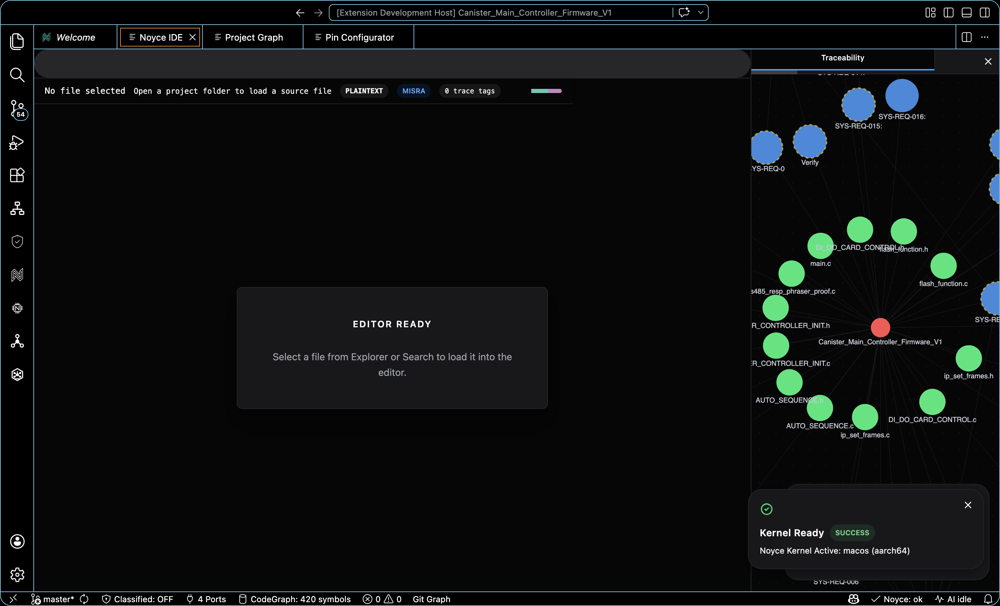
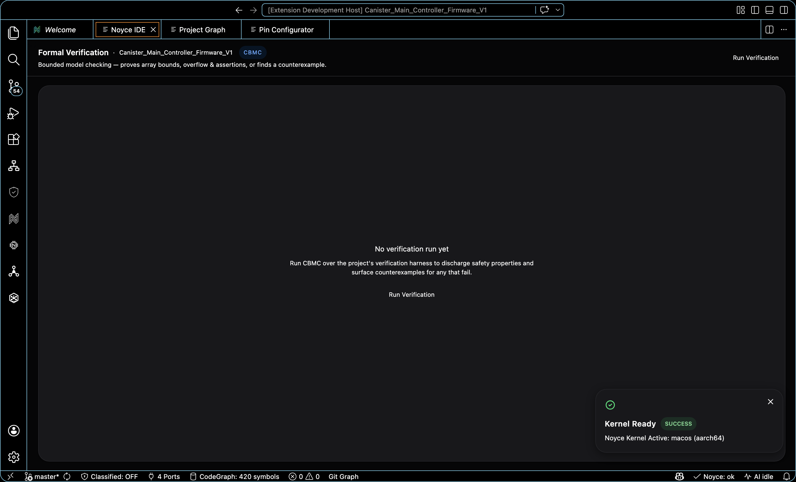
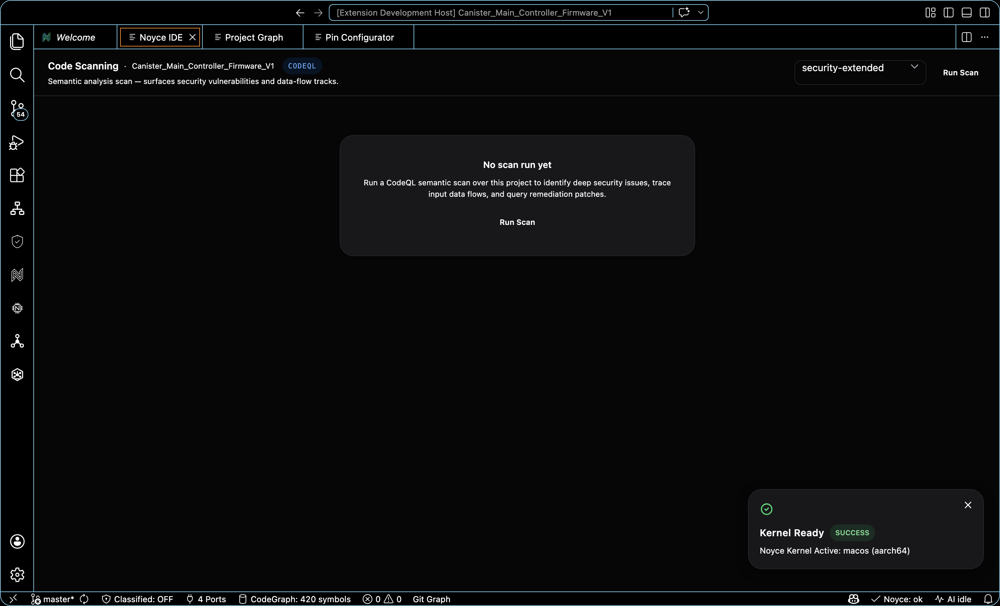

<div align="center">


### The AI-native IDE for safety-critical embedded engineering

Code-OSS based desktop workbench that brings **requirements, source, certification evidence, hardware tooling, and a multi-agent AI pipeline** into a single window — purpose-built for DO-178C, ISO 26262, and MISRA-grade firmware teams.

[](https://www.typescriptlang.org/)
[](https://react.dev/)
[](https://vitejs.dev/)
[](https://tailwindcss.com/)
[](https://github.com/microsoft/vscode)
[](https://www.electronjs.org/)
[](https://www.rust-lang.org/)
[](https://microsoft.github.io/monaco-editor/)
[](https://d3js.org/)
[](https://playwright.dev/)
[](https://github.com/Hitheshkaranth/noyce_ide/actions/workflows/ci-runtime-smoke.yml)
[](https://github.com/Hitheshkaranth/noyce_ide/releases/latest)
[](#license)

[**Quick Start**](#quick-start) · [**Features**](#features) · [**Architecture**](#architecture) · [**Build & Release**](#build--release) · [**Distribution**](https://github.com/Hitheshkaranth/noyce-ide-dist)

</div>

---

## Why Noyce IDE

Modern safety-critical firmware work fragments across a requirements manager, two static analyzers, a traceability matrix, a CI dashboard, an AI assistant, and a stack of vendor IDEs. Noyce IDE collapses all of that into one Code-OSS workbench with first-class:

- **Hardware-aware editing** — pin maps, peripheral registers, RTOS thread state, schematic views, signal/protocol decoders.
- **Schematic intelligence** — open a board's schematic PDF and the viewer reads it: positioned text extraction makes the whole drawing **searchable to the character** (host-side **LiteParse** parsing + **PaddleOCR PP-OCRv5** OCR for scanned sheets, with an in-webview pdf.js + Tesseract.js fallback), every reference designator is parsed into an **auto-generated Bill of Materials** (class-aware value pairing, grouped quantities), and an **inferred component relationship graph** reconstructs the system topology from shared nets and layout. Pan and zoom the page like a native viewer.
- **Certification evidence built in** — DO-178C Table A objectives, MISRA rule decoding, MC/DC coverage, and a **hash-chained immutable audit ledger** that signs every review and approval into a tamper-evident chain. Each objective routes to its **specialist agent** (System Designer → SRS/SDD, Test Engineer → test cases, Compliance Reviewer → verification records) to generate the artifact. One click then assembles a **Certification Evidence Package** — requirements + traceability, MISRA, CBMC proofs, CodeQL alerts, review records and the audit trail — into a signed HTML + JSON artifact whose SHA-256 digest is anchored to the audit-trail head, so the whole package is tamper-evident.
- **Formal verification, in-IDE** — run real **CBMC** bounded model checking over a project's harness to discharge array-bounds, overflow, and assertion properties, with a properties table and step-by-step counterexample trace (plus AI failure explanation) for anything that fails.
- **Semantic code scanning** — drive the real **CodeQL** CLI to surface security vulnerabilities as SARIF alerts, walk each finding's data-flow path, and apply a structured, AI-explained remediation patch.
- **Architecture, recovered from source** — a **swark-style HLD pipeline** reconstructs subsystem topology straight from the codebase (source → Gemma → Mermaid) into an interactive High-Level Design view, with C4 / Structurizr export.
- **Supply-chain assurance** — a real-source SBOM with OSV-backed CVE lookup in the Cyber Assurance surface.
- **A 755-tool static-analysis catalog** — browse the vendored [analysis-tools-dev](https://github.com/analysis-tools-dev/static-analysis) catalog filtered to your stack, run a curated executable subset (cppcheck, clang-tidy, ESLint, Ruff, ShellCheck), and apply MISRA single-exit auto-fixes.
- **A multi-agent AI pipeline** — system designer, coder, reviewer, tester, doc generator, traceability monitor — each with its own configurable model provider; generated objectives sync straight into the AI Orchestrator kanban.
- **Real CI surfaces** — build, static analysis, unit, HIL, and traceability stages in one live pipeline view.

Branded as a polished Code-OSS Electron app on a clean shadcn-neutral design system: it looks like the IDE engineers already use; it works the way safety teams already audit.

---

## Screenshots

> Every screenshot below is captured from the running **Code-OSS Electron build** with a **real firmware project open** — the TI **Tiva TM4C1294NCPDT** *Canister Main Controller* firmware, imported from source. Each surface is rendered live against that project's code, requirements, pin map, and schematic; the analysis surfaces (MC/DC, coupling, schematic BoM, architecture) are re-run against the loaded firmware for every capture. Nothing here is a mockup or a browser preview.

### Getting Started — the surface launcher


The home surface of the embedded workbench: a grid of every tool the IDE offers — Editor, Semantic Search, Requirements, Traceability, MISRA, CBMC, CodeQL, Test Explorer, Compliance, DC/CC, MC/DC, DO-178C Documents, Cyber Assurance, Audit Trail, Architecture, Project Graph, Schematic + BoM, Register Inspector, Fault Analyzer, Peripheral Registers, Signal Viewer, Serial Monitor and the Build Pipeline. Recent projects and quick actions (new project, open folder, load demo) sit alongside. One click opens any surface against the currently loaded project.

---

### Code & architecture

#### Editor — compliance-aware Monaco



The full Monaco editor with the firmware source, requirement-annotation gutters, and inline compliance highlights. `.md`/`.markdown` files open in a Milkdown WYSIWYG editor instead of the raw text view. The status bar surfaces the live CodeGraph symbol count, port state, and AI status.

#### Project Graph — symbol / file / macro topology


Live dependency view of every function, file, and macro in the workspace — here **160 symbols, 95 functions, 24 files, 40 macros, 325 active links**. The graph roots at the detected entry point (`main`), and selecting a node opens its full detail: source location, doc comment, and its callers / callees / macro uses. **Cluster by** directory, layer, language, Louvain community, or blast radius with coloured concave hulls.

#### System Architecture — C4 model recovered from source


An AI-assisted analyzer reads the codebase and reconstructs a **Structurizr-style C4 model** — here **24 files · 95 functions · 3 subsystems · 116 relationships · 12 types**, with Context / Containers / Components / Code / Dependencies / Data-Flow / Embedded levels. Every node is clickable (double-click opens its source). One-click export to **High-Level Design, Archify diagrams, DSL, Mermaid, Markdown, Draw.io, JSON, SVG, PNG, and PDF**. *(Diagram generation runs against the configured model provider; a cloud or non-reasoning local model is recommended for the AI-drawn Archify/HLD outputs.)*

#### Semantic Search — natural-language RAG over the workspace


A local nomic-embedding RAG index over the code + requirements powers natural-language search across the workspace — ask a question in plain English and jump to the most relevant functions, files, and requirement chunks. The same index grounds the agent pipeline.

---

### Requirements, coverage & certification (DO-178C)

#### Requirements & Evidence — ALM bridge with a per-requirement evidence ledger


A requirement register synced through an ALM bridge (Jama Connect / generic), each `SYS-REQ` carrying owner, priority, rationale, trace status, and an **evidence ledger** of linked design notes, source lines, tests, and review artifacts — with trace-ready / coverage-gap / verified-evidence roll-ups across the top.

#### Compliance Dashboard — DO-178C Table A objectives, live


Requirements linked, design allocation, verification evidence, and open static-analysis findings — all derived live from the active project. Each objective routes to its **specialist agent** to generate the artifact, and the toolbar jumps straight to the analysis surfaces (**Coupling**, **MC/DC Coverage**, static analysis, test explorer). Export a DO-178C evidence pack or a SHA-256-anchored **Certification Package**.

#### Traceability Graph — REQ ↔ Design ↔ Test


Force-directed graph that ties requirements (`SYS-REQ-001`, …) to source files, design notes, and test cases, built from the same workspace source as the Compliance Dashboard. Verified links render green; orphans and gaps render red.

#### MC/DC Structural Coverage — DO-178C A-7 obj 5/6/7


Extracts every decision (`if`/`while`/`for`/ternary) from the loaded firmware, splits each into atomic conditions, and computes the Statement / Decision / MC/DC obligations — here **433 decisions across the project, 116 MC/DC conditions, 160 required independence vectors**, reported honestly as 0% until requirement-based tests are linked. A three-pane files → decisions → truth-table view shows each condition's independence pair, and an **AI Coverage** panel can *Generate Coverage Tests* or *Fix Uncovered Decisions* via the agent pipeline.

#### Data & Control Coupling — DO-178C A-7 obj 8


Deterministic coupling coverage computed from the project-graph call edges and source-level shared-data access — here **24 components, 17 control-coupling pairs, 59 data-coupling pairs**, with a coupling matrix and a ranked list of the **76 uncovered couplings** (each with its concrete call sites, e.g. `CANISTER_CONTROLLER_INIT.c → SYS_TIME_RTC.c`). Coverage is honest until requirement-based test evidence links the pairs.

#### CBMC Formal Verification — bounded model checking



Runs real **CBMC** bounded model checking over the project's harness to discharge array-bounds, overflow, and assertion properties, with a properties table and a step-by-step counterexample trace (plus an AI failure explanation) for anything that fails.

#### CodeQL Code Scanning — SARIF security alerts



Drives the real **CodeQL** CLI to surface security vulnerabilities as SARIF alerts, walk each finding's data-flow path, and apply a structured, AI-explained remediation patch.

#### MISRA Diagnostics — rule-decoded findings with agent auto-fix


Consolidated findings from the multi-tool static-analysis run, decoded to the rule (e.g. MISRA C:2025 Rule 15.5 — single point of exit) with severity filters, control-flow context, and a one-click **Auto-fix** that routes structural rules to a function-level refactor agent and applies the result on the host.

#### Test Explorer, DO-178C Documents & Cyber Assurance

<table>
<tr>
<td width="50%"><b>Test Explorer</b> — requirement-linked unit / HIL test tree with pass/fail roll-up<br></td>
<td width="50%"><b>DO-178C Documents</b> — generated plans &amp; records as formal, print-ready <code>.docx</code><br></td>
</tr>
<tr>
<td width="50%"><b>Cyber Assurance</b> — real-source SBOM with OSV-backed CVE + CWE posture<br></td>
<td width="50%"><b>Immutable Audit Trail</b> — hash-chained review &amp; approval ledger<br></td>
</tr>
</table>

The **Audit Trail** signs every agent completion, review, and approval into a tamper-evident **hash chain** (actor, action, timestamp, per-entry SHA) — filter by actor/date, verify **Chain Integrity** at a glance, and export to HTML or JSON.

---

### Hardware & schematic intelligence

#### Schematic Viewer — the board schematic, rendered


Opens the board's schematic PDF (here the real Tiva TM4C1294 canister-controller sheet, page 1/3) and renders it like a native viewer — pan, zoom, and full-text **Find**. **Analyze** runs positioned-text extraction / OCR to make the drawing searchable to the character and to build the auto-BoM and component graph below.

#### Auto-BoM — extracted *after* analysis


After **Analyze** (here **1,674 text items → 222 parts**), every reference designator is parsed into a class-aware **Bill of Materials** — Capacitor ×79, Diode ×17, Ferrite Bead ×3, Connector ×10, Battery ×2, Module/Assembly ×4 … — grouped by class with quantities and designators, ready to open in the BoM Studio or export.

#### Inferred Component Graph — topology from the layout


An inferred component relationship graph reconstructs the board topology from shared net labels + proximity — here **222 parts · 758 links · 95 nets** — surfaced next to the schematic. (Inferred from layout, not a parsed netlist.)

#### Register Inspector, Peripheral Map, Fault Analyzer, Signal Viewer & Serial Monitor

<table>
<tr>
<td width="50%"><b>Register Inspector</b> — CMSIS-SVD peripherals + live bitfield decode<br></td>
<td width="50%"><b>Peripheral Registers</b> — peripheral / pin map traced from the detected config<br></td>
</tr>
<tr>
<td width="50%"><b>Fault Analyzer</b> — Cortex-M HardFault decoded from a register/CFSR dump<br></td>
<td width="50%"><b>Signal Viewer</b> — logic-analyzer waveforms (SPI / PWM / PID)<br></td>
</tr>
<tr>
<td width="50%"><b>Serial Monitor</b> — real serial I/O through the Rust sidecar<br></td>
<td width="50%"><b>Build Pipeline</b> — embedded CI stages (analysis → build → unit → HIL → docs) with live logs<br></td>
</tr>
</table>

The **Fault Analyzer** decodes a pasted CFSR / HFSR / BFAR + stacked frame into the precise exception (BusFault / MemManage / UsageFault) with the decoded bit flags and an AI root-cause; load the `.map` for symbolised PC/LR. The **Serial Monitor** performs real serial I/O via a pty-tested Rust sidecar.

---

## Features

| Category | Surfaces |
| --- | --- |
| **Compliance & Certification** | Compliance Dashboard (multi-agent per-objective artifact generation) · DO-178C Evidence Pack · **Certification Evidence Package** (SHA-256-anchored, tamper-evident HTML + JSON) · Traceability Graph · Requirements Explorer · MISRA Diagnostics + single-exit auto-fix · MC/DC Coverage · Quality Trend · Annotation Navigator · Immutable Audit Ledger (hash-chained) |
| **Verification & Security** | Formal Verification (real CBMC bounded model checking · properties table · counterexample trace) · Code Scanning (real CodeQL · SARIF alerts · data-flow paths · AI remediation) · Cyber Assurance (real-source SBOM + OSV CVEs) |
| **Architecture** | Architecture Analyzer (swark-style source → Gemma → Mermaid) · High-Level Design view · C4 / Structurizr export |
| **Static analysis** | 755-tool catalog (vendored analysis-tools-dev) with language-filtered Browse Catalog · runnable subset (cppcheck · clang-tidy · ESLint · Ruff · ShellCheck) · catalog-driven multi-tool scans |
| **Hardware-aware editing** | Pin Configurator · Peripheral Registers · Memory View · RTOS Thread Viewer · **Schematic Viewer** (LiteParse + PaddleOCR text/search · auto-BoM · inferred component graph · pan/zoom) · Debug Probe Panel · Fault Analyzer (Cortex-M CFSR decoded) · Linker Memory Map |
| **Signal & protocol** | Logic-analyzer Signal Viewer · Serial Monitor · Modbus Monitor · Energy Profiler (LoRa / BLE / sense-burst presets) · Live Data Dashboard (Power / Motor / Comms) |
| **CI / Build** | Build Pipeline (Static Analysis / Build / Unit / HIL / Docs) · Build Size Treemap · Project Templates · Project Graph |
| **AI** | Multi-agent Orchestrator · Agents Chat with persona + per-call model selection · Provider settings (Gemini / Anthropic / OpenAI / Ollama / LM Studio / Codex CLI / Claude CLI) · Inline completions · Code-lens agent actions |
| **Team & lifecycle** | Team Activity · Review Workflow · Audit Log · Project Templates |
| **Importers** | STM32CubeIDE `.ioc` · TI Tiva (TivaWare) · Code Composer Studio · MPLAB X / NetBeans · Generic folder |

---

## Architecture

```text
Noyce IDE (single Electron process tree)
├── Code-OSS desktop shell
│   ├── Noyce product.json overlay + rebrand patch
│   └── 11 first-party VS Code extensions
│       (core-ui · stm32 · fpga · telemetry · compliance · hardware ·
│        lifecycle · project-graph · architecture · agents · chat)
│
├── React 18 + TypeScript bundle  (src/, built by Vite)
│   ├── Workbench surfaces (compliance, build, AI, hardware, …)
│   ├── Monaco editor · D3 graphs · xterm.js · Tailwind
│   └── Density-responsive panels (sidebar ↔ editor-tab)
│
└── Rust sidecar  (services/noyce-core/)
    ├── JSON-RPC over stdio
    ├── Workspace IO, project import (.ioc / CCS / MPLAB / Tiva)
    ├── Static-analysis + MISRA scanners
    ├── CBMC formal verification dispatch
    └── Hardware enumeration (serial, debug probes, JTAG)
```

The release path keeps Noyce-owned configuration **separate from the vendored Code-OSS checkout**: `scripts/lib/codeoss-pin.json` pins upstream commit + Node version; `npm run codeoss:bootstrap:windows` prepares the checkout, renders `apps/noyce-workbench/generated/product.json`, syncs it into Code-OSS, applies the tracked rebrand patch, and copies overlay files (icons, badge, welcome content).

**Project stays pristine** — everything the IDE generates for an open project (certification evidence, traceability / DO-178C docs, the audit ledger, CodeQL scratch, schematic analysis) is written under a single `<project>/.noyce/` working directory that carries its own `.gitignore` (`*`). The workbench never scatters files across the project root or touches any existing file — including the project's own `.gitignore` — so the codebase you opened is unchanged and git-clean. Host-side schematic parsing (LiteParse + PaddleOCR, via the extension host) and CodeQL both run through the host bridge and clean up their scratch, falling back to in-webview engines when no host is attached.

---

## Repository Layout

| Path | Role |
| --- | --- |
| `apps/noyce-workbench/` | Product template, checkout sync scripts, generated product config, overlay assets, rebrand patch |
| `third_party/code-oss/` | Pinned upstream Code-OSS source used for reproducible workbench builds |
| `src/` | Shared React surfaces (compliance, hardware, AI, build, project graph, …) |
| `extensions/` | First-party Noyce VS Code extensions (10 of them) |
| `services/noyce-core/` | Rust sidecar — JSON-RPC over stdio for workspace IO, importers, hardware enumeration |
| `crates/` | STM32 / Tiva importers, project model utilities |
| `tests/` | Playwright smoke + feature-tour specs |
| `scripts/` | Bootstrap + release scripts (Windows installer, signing, schema check) |

---

## Quick Start

### Local React surface (fast UI iteration)

```bash
npm install
npm run dev               # Vite at http://localhost:5173 — React surfaces, mock data
```

### Full Code-OSS workbench (release-grade)

Prerequisites: Node `22.22.1`, Python 3, Visual Studio Build Tools with VC v142 Spectre components (Windows), Git.

```bash
# Windows build
npm ci
npm run codeoss:bootstrap:windows   # prepares third_party/code-oss
npm run workbench:launch            # opens the workbench

# macOS / Linux (already-built shell)
npm ci
npm run workbench:launch
```

`npm run workbench:doctor:windows` diagnoses missing prereqs. See [`docs/windows-code-oss-remediation.md`](docs/windows-code-oss-remediation.md).

### Verification

```bash
npm run build         # tsc + vite production build
npm run smoke:ui      # Playwright smoke (CI gate)
npm run check         # build + cargo check on the Rust sidecar
npm run rpc:schema:check
```

The single CI gate is `.github/workflows/ci-runtime-smoke.yml` — runs `npm run verify:ui` on every push and PR to `main`.

---

## Build & Release

| Workflow | Trigger | Output |
| --- | --- | --- |
| `ci-runtime-smoke.yml` | push / PR to `main` | tsc + vite build, Playwright smoke |
| `release-windows.yml` | tag `v*` or `workflow_dispatch` | Signed Windows x64 installer attached to release |

```bash
npm run release:windows           # local installer build
npm run release:signing:check     # verify code-signing env
```

---

## Tech Stack

**Frontend** — React 18 · TypeScript 5.6 · Vite 5 · Tailwind 3 · Monaco · D3 · xterm.js
**Desktop shell** — Code-OSS · Electron · 10 first-party VS Code extensions
**Native sidecar** — Rust · `tokio` · `serialport` · `probe-rs` · `walkdir`
**AI providers** — Google Gemini · Anthropic · OpenAI · Ollama · LM Studio · Codex CLI · Claude CLI
**Quality** — TypeScript strict · Playwright smoke + feature tour · `cargo check`

---

## Distribution

End-user downloads live at [`Hitheshkaranth/noyce-ide-dist`](https://github.com/Hitheshkaranth/noyce-ide-dist). This repository hosts the source; the dist repository ships installers.

## License

Proprietary — © 2026 Noyce IDE. All rights reserved.

---

<div align="center">

<sub>Built for engineers who ship firmware that has to be right.</sub>

</div>
