<div align="center">


### The AI-native IDE for safety-critical embedded engineering

Code-OSS based desktop workbench that brings **requirements, source, certification evidence, hardware tooling, and a multi-agent AI pipeline** into a single window — purpose-built for DO-178C, ISO 26262, and MISRA-grade firmware teams.

[](https://www.typescriptlang.org/)
[](https://react.dev/)
[](https://vitejs.dev/)
[](https://tailwindcss.com/)
[](https://github.com/microsoft/vscode)
[](https://www.electronjs.org/)
[](https://www.rust-lang.org/)
[](https://microsoft.github.io/monaco-editor/)
[](https://d3js.org/)
[](https://playwright.dev/)
[](https://github.com/Hitheshkaranth/noyce-ide-dist/releases/latest)
[](#license)

[**Quick Start**](#quick-start) · [**Features**](#features) · [**Architecture**](#architecture) · [**Build & Release**](#build--release) · [**Distribution**](https://github.com/Hitheshkaranth/noyce-ide-dist)

</div>

---

## Why Noyce IDE

Modern safety-critical firmware work fragments across a requirements manager, two static analyzers, a traceability matrix, a CI dashboard, an AI assistant, and a stack of vendor IDEs. Noyce IDE collapses all of that into one Code-OSS workbench with first-class:

- **Hardware-aware editing** — pin maps, peripheral registers, RTOS thread state, schematic views, signal/protocol decoders.
- **Schematic intelligence** — open a board's schematic PDF and the viewer reads it: positioned text extraction makes the whole drawing **searchable to the character** (host-side **LiteParse** parsing + **PaddleOCR PP-OCRv5** OCR for scanned sheets, with an in-webview pdf.js + Tesseract.js fallback), every reference designator is parsed into an **auto-generated Bill of Materials** (class-aware value pairing, grouped quantities), and an **inferred component relationship graph** reconstructs the system topology from shared nets and layout. Pan and zoom the page like a native viewer.
- **A compliance run you can reproduce** — one command freezes the configuration (commit, tree state, level), executes every evidence producer, and writes a hashed, append-only record. Runs diff against each other at the level of **objectives**, so a regression reads as *"A-7 objective 5 stopped being satisfied"* rather than as a number that moved. A producer that did not execute claims nothing — including the CBMC and CodeQL *sample* fallbacks, which are right for a panel and are fabricated evidence in a signed package.
- **Certification evidence built in** — DO-178C Table A objectives, MISRA rule decoding, MC/DC coverage, and a **hash-chained immutable audit ledger** that signs every review and approval into a tamper-evident chain. Each objective routes to its **specialist agent** (System Designer → SRS/SDD, Test Engineer → test cases, Compliance Reviewer → verification records) to generate the artifact. One click then assembles a **Certification Evidence Package** — requirements + traceability, MISRA, CBMC proofs, CodeQL alerts, review records and the audit trail — into a signed HTML + JSON artifact whose SHA-256 digest is anchored to the audit-trail head, so the whole package is tamper-evident.
- **Formal verification, in-IDE** — run real **CBMC** bounded model checking over a project's harness to discharge array-bounds, overflow, and assertion properties, with a properties table and step-by-step counterexample trace (plus AI failure explanation) for anything that fails.
- **Semantic code scanning** — drive the real **CodeQL** CLI to surface security vulnerabilities as SARIF alerts, walk each finding's data-flow path, and apply a structured, AI-explained remediation patch.
- **Architecture, recovered from source** — a **swark-style HLD pipeline** reconstructs subsystem topology straight from the codebase (source → Gemma → Mermaid) into an interactive High-Level Design view, with C4 / Structurizr export.
- **Supply-chain assurance** — a real-source SBOM with OSV-backed CVE lookup in the Cyber Assurance surface.
- **A 755-tool static-analysis catalog** — browse the vendored [analysis-tools-dev](https://github.com/analysis-tools-dev/static-analysis) catalog filtered to your stack, run a curated executable subset (cppcheck, clang-tidy, ESLint, Ruff, ShellCheck), and apply MISRA single-exit auto-fixes.
- **A multi-agent AI pipeline** — system designer, coder, reviewer, tester, doc generator, traceability monitor — each with its own configurable model provider; generated objectives sync straight into the AI Orchestrator kanban.
- **Real CI surfaces** — build, static analysis, unit, HIL, and traceability stages in one live pipeline view.

Branded as a polished Code-OSS Electron app on a clean shadcn-neutral design system: it looks like the IDE engineers already use; it works the way safety teams already audit.

---

## Screenshots

> Every screenshot below is captured from the running **Code-OSS Electron build** with a **real firmware project open** — the TI **Tiva TM4C1294NCPDT** *Canister Main Controller* firmware, imported from source. Each surface is rendered live against that project's code, requirements, pin map, and schematic; the analysis surfaces (MC/DC, coupling, schematic BoM, architecture) are re-run against the loaded firmware for every capture. Nothing here is a mockup or a browser preview.

### New in 2.0.4 — compliance becomes a record, not a reading

Every compliance surface in this workbench answered *what is true right now*. That is useful while working and useless as evidence: two people looking on two days saw two different answers, and neither could say which configuration the answer was about. A certification authority asks the opposite question — **as of this baseline, what was measured, by what, and what is still outstanding** — and nothing here could answer it.

**Compliance Run** is a new surface that does. One command freezes the configuration (commit, working-tree state, assurance level), runs every evidence producer in order, and writes an append-only record under `.noyce/compliance-runs/`. Runs compare against each other at the level of objectives rather than percentages: *"A-7 objective 5 stopped being satisfied"*, not *"MC/DC fell from 82% to 79%"*. The assessment digest excludes timestamps and durations, so an unchanged tree reproduces it exactly.

**Annex A is now reported against its real denominators.** The module that models all 71 Level A objectives across the ten tables was imported by nothing but its own test, while the dashboard ran on a 69-objective paraphrase whose Table A-5 carried the DO-178B seven — short exactly the two DO-178C parameter-data-item objectives. The assessment is now the status authority everywhere, including the signed package: a table with one measured objective out of thirteen reports **"1 of 13"** and can never render as a pass. Producers map to objectives through a registry that ships only the four mappings this codebase had already established; everything else is mapped by the project from its own licensed copy in `.noyce/annex-a/map.json`, or stays **unmapped and therefore unauditable**. Objective *wording* is licensed by RTCA and is not shipped — it loads from `.noyce/annex-a/text.json` or objectives stay identified by number. Nothing invents a fallback.

**A producer that did not run claims nothing.** Not a zero, not a failing claim. Coverage analysed but never measured produces no claim at all; CBMC with zero properties proves nothing and says so; coupling with no component pairs is not fully-exercised coupling. The sharpest case: `cbmc-runner` and `codeql-runner` fall back to seeded **sample** results when the tool is absent, so a panel always renders — right for a panel, and fabricated evidence in a signed package. Both carry `source: 'sample'`, and a run treats that as *did not run*. An unknown working-tree state is recorded as unknown and blocks export rather than being rounded down to clean.

**Verification is data now, not prose.** SVCP and SVR were section templates a model wrote into, so Tables A-6 and A-7(1–4) had never had a numerator. Cases and results are first-class records — requirements verified, method, normal-range or robustness, host/simulator/target, expected result — and requirements-based coverage is computed from them. A case with no result is *not-run*, never a pass. A host result does not discharge target compatibility. An unreviewed case is inadmissible at Levels A and B. Level-specific objectives are attributed only when requirements carry a level; a project recording none is told so rather than having the gap read as coverage. Coverage shortfall is **resolved**, not just measured: every uncovered obligation is classified as a missing case, dead code, deactivated code with its means of prevention, or justified with rationale and approver — and a missing verification case is never a resolution.

**Process records close the half of Annex A no analyser reaches.** Problem reports and change control, with closure that requires a disposition and a confirmation by someone other than the person who dispositioned it. Review records whose **independence is derived** from author ≠ reviewer rather than asserted as a boolean — that is precisely the field a programme under schedule pressure would set wrongly. And the eight-question conformity review an SOI #4 opens with, hashed into the run, where a question the recorded evidence cannot answer is not a pass. A `process-only` table backed by records now reads as *substantiated by a named person on a date*, which is what the objective asks for, instead of *proved by a tool*, which it never is.

Known gap, stated rather than hidden: the Software Configuration Index is not yet built from the real toolchain output, so the conformity review reports "no configuration index has been produced" and that question fails honestly.

### New in 2.0.3 — every surface opens as itself, and code viewing is Code-OSS's

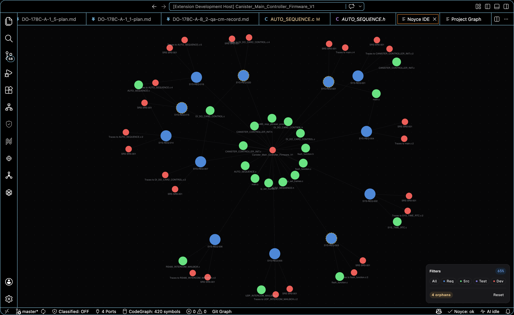

Clicking **Traceability Graph** used to open the *editor shell* with the graph docked into a side rail — a tile named after a graph gave you an empty editor and a strip. Every tile now opens its own surface, full pane, which is also what makes the graph readable: fitted to the pane, it sits at 65% instead of 21%, so the requirement, source and test labels are legible without touching the zoom.

The webview's own Monaco pane is gone from the launcher along with it. Code-OSS is already the editor in that window — with the explorer, the tabs, the git decorations and the language services — and the panel was mirroring the host's open file into a second, weaker copy of it. Three separate paths did that mirroring, and each also forced the panel onto the editor surface: opening a project hydrated an "initial file", the shared-workspace sync opened whatever the host had focused, and `Open` on a MISRA or CodeQL finding revealed the shell. **Open** now opens the real editor at the requested line (through `vscode.open`, so the Markdown WYSIWYG and PDF viewers still win), and the Noyce panel stays on the surface you picked.

#### Register Knowledge could never read a manual inside the IDE

Indexing downloaded the vendor PDF and then reported *No reference manual indexed* with `No "GlobalWorkerOptions.workerSrc" specified.` — pdf.js refusing to open the file. pdf.js decides it is running under Node by checking that it is **not** inside Electron, and the extension host is exactly that, so it took its browser path and demanded a worker. Under plain `node` the identical call parses the 1,892-page manual in 2.2s, which is why this only failed in the running product and why the host module's tests never saw it. With the worker path set, indexing completes: **876 registers, 654 with bit fields, 592 rules** — see [Register Knowledge](#register-knowledge--the-parts-reference-manual-indexed-and-page-cited) above.

Code Scanning had a matching fault: it passed `--download` to `codeql database analyze` unconditionally, so even a working install went to GitHub's package registry for `codeql/cpp-queries` — and a CodeQL CLI older than the one that published the pack cannot parse the manifest it gets back (`Unrecognized field "digest"`). Every project fell through to the sample findings, behind an honest banner. The flag is now used only when CodeQL came from `PATH`; the vendored bundle carries its own query packs, so the suite resolves locally and the scan completes offline.

Firmware Memory, in the same pass, stopped telling TI Code Composer projects to add `-Wl,-Map=` through STM32CubeIDE's menus. That project links with `armcl` and a `.cmd` command file and has neither, and the analyser reads GNU ld maps only — so the advice would not have worked even if it had been followed. It now names the linker it found and says what is not supported.

### New in 2.0.2 — the UI says only what is true

`2.0.2` is a correctness release for the workbench surface itself. Every fault below was found by reading the *rendered* views — none is a type error, a lint error, or something a test would have caught — and every fix was verified by measuring the live DOM in the running Code-OSS build with the `/office` **Canister Main Controller** firmware loaded.

#### The workbench had no height, and the editor bar described files that were not open

The React mount node was `height: auto`, so `#root` collapsed to its content — measured at **203px inside a 793px window** — and every `h-full` beneath it resolved against a collapsed box. Panes that size themselves from their container, the traceability graph most visibly, drew into a fraction of the space they appeared to own. The graph now fills its pane, frames the **whole** graph including node labels (fitting on the circles alone clipped the outermost names), and re-centres when the pane is resized rather than orbiting the size it was built with.

The editor status bar used to show a `plaintext` language chip, a `MISRA` chip and a three-segment bar hardcoded to 45/30/25 — none of it computed, all of it shown even with no file open. It now reports the file, its language when the language is actually known, and the trace-tag count, which is the one thing on that bar that was ever measured.

#### Every button in the workbench was losing its surface

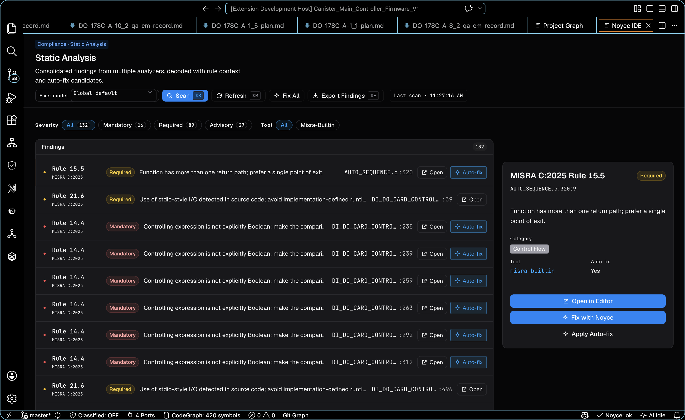

A cascade layer takes its position from where it is first mentioned, and in the emitted bundle `components` (HeroUI) was registered before `base` (Tailwind preflight). The later layer wins, so preflight's `button { background-color:#0000; border-radius:0 }` was overriding HeroUI's own `.button { background-color: var(--button-bg) }` on **every** button in the product — a `.button--secondary` computed `rgba(0,0,0,0)` while its `--button-bg` resolved correctly. Primary actions read as plain words. Fixed in the base layer itself, so component defaults return while call-site utilities still win.

#### Truncation that removed the distinguishing part

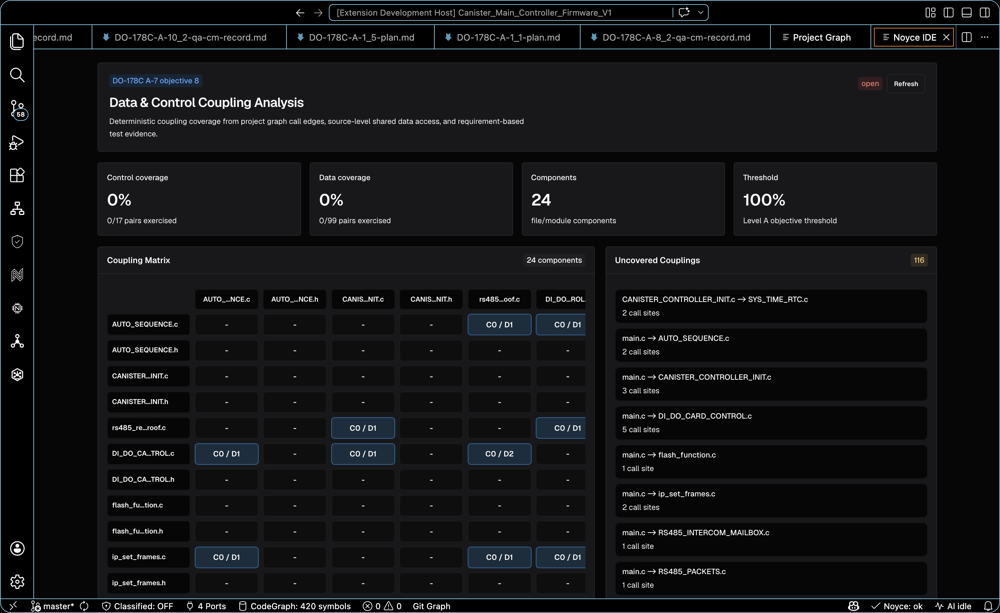

The coupling matrix truncated `AUTO_SEQUENCE.c` and `AUTO_SEQUENCE.h` to the same `AUTO_SEQU…`, leaving adjacent rows and columns indistinguishable. Labels now elide from the **middle**, so the extension survives — with a tighter budget for the narrower header cells, because CSS otherwise takes the tail back off.

#### A constant presented as project data

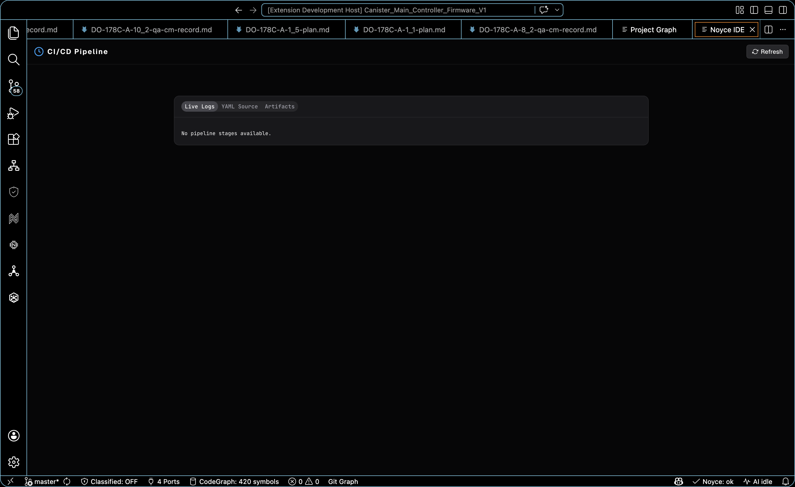

The CI/CD Pipeline header carried a `DCO-5000-103 Qualification Build` chip — the same build identifier for every project, every pipeline and every run, in the place a reader looks to learn what they are looking at. Nothing in the build status carries an identifier, so the header now names the view and stops. The `YAML Source` tab beside it no longer wraps and clips inside its own pill, the Test Explorer's `AI Generate` / `Run All` actions render as buttons, and the DO-178C panel no longer offers two identical `Blank SRS` buttons.

<details>
<summary>Everything else in 2.0.2</summary>

- Editor status bar no longer prints a project-root file's name twice (its relative path *is* its name), and its empty state stops telling you to open a project folder when one is already open.
- Traceability **Reset** re-frames the graph instead of jumping to a fixed 100% zoom that was only ever the right view by accident.
- Section headers in the secondary sidebar and bottom panel can grow with their content instead of clipping at a fixed 36px.
- A repeatable view-capture harness (`npm run qc:capture`) drives the running Code-OSS build through all 26 Noyce surfaces and screenshots each one, so the next regression of this kind is visible rather than inferred.

</details>

### New in 2.0.1 — verified native Code-OSS fixes

The `2.0.1` release tightens several native workbench paths that were validated inside the running Noyce Code-OSS application, using isolated copies of real projects from `/office`.

#### Compliance Dashboard → Data & Control Coupling


The Compliance Dashboard toolbar now opens the registered native Code-OSS `Data & Control Coupling` panel through the host command bridge. This fixes the `2.0.0` path where coupling could be opened from the command palette but was not reliably accessible from the Compliance section.

#### Data & Control Coupling — refreshed analyzer output

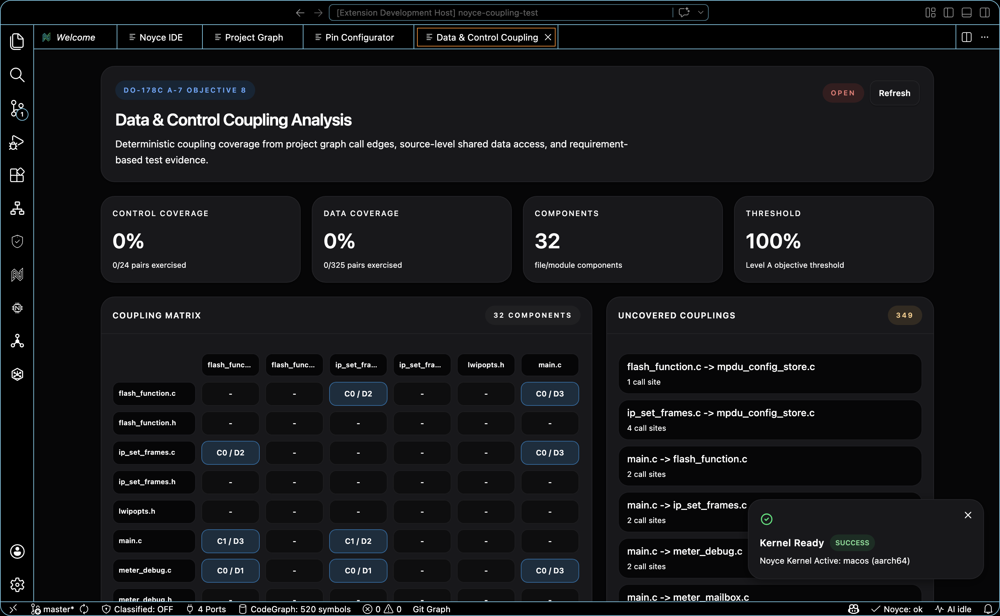

The coupling analyzer now handles embedded C top-level parsing more accurately: preprocessor directives no longer hide globals declared after `#include`, and declaration-only `extern` globals in headers no longer duplicate data-coupling pairs. The screenshot shows the real `MPDU_4000_CONTROLLER_V1` project copy with **32 components**, **24 control pairs**, and **325 data pairs** rendered after opening the feature from Compliance.

#### Quality Trend — fix-and-refresh feedback

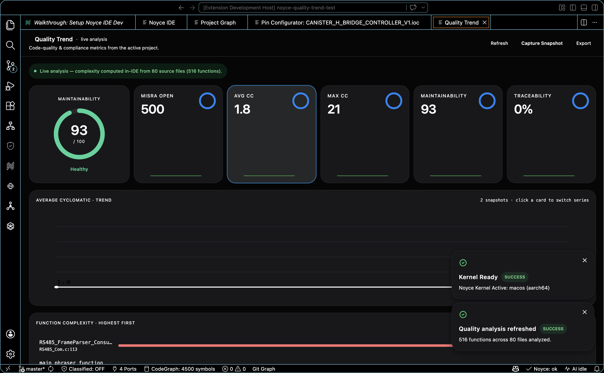

Quality Trend now recomputes and refreshes in the native editor after a controlled source fix. The verification pass captured the screen changing from the earlier metric state to **Max CC 21**, with **2 snapshots** available and 516 functions analyzed across 80 files.

#### STM32 `.ioc` pin configuration parsing

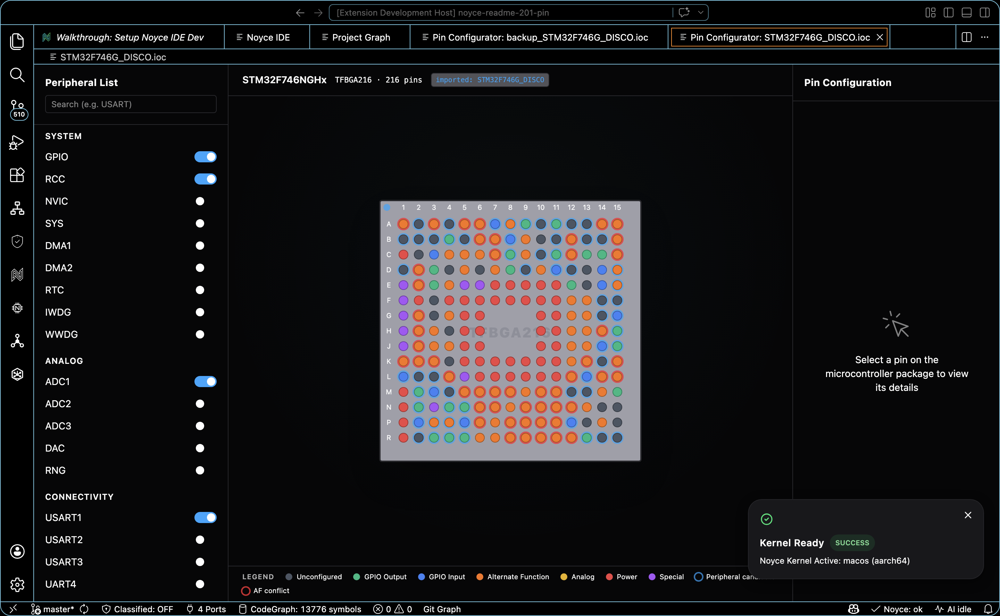

The Pin Configurator now reads STM32CubeMX `.ioc` package and pin configuration thoroughly enough to render the actual MCU package instead of a blank/no-pins view. This capture uses a real `/office` project copy with `STM32F746G_DISCO.ioc`, rendering `STM32F746NGHx` as **TFBGA216 · 216 pins** with the peripheral list and colored pin grid populated.

### Getting Started — the surface launcher

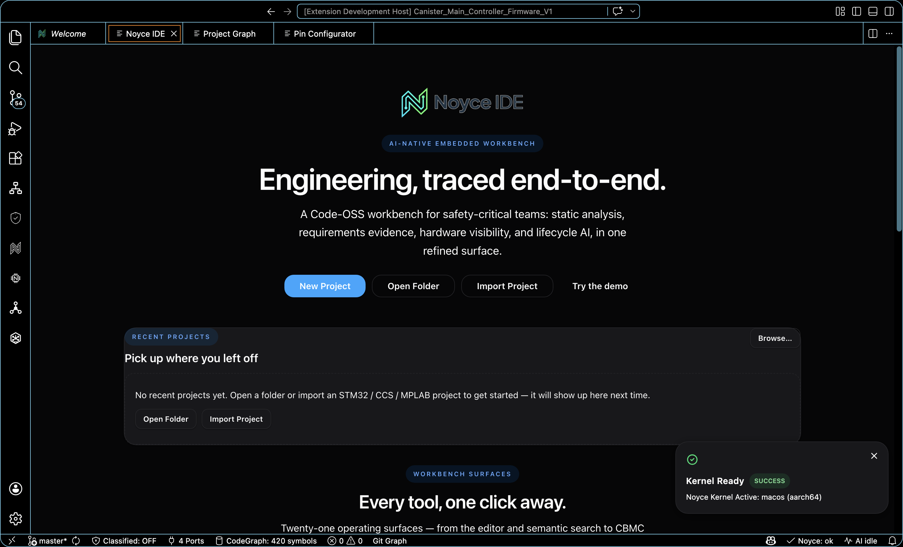

The home surface of the embedded workbench: a grid of every tool the IDE offers — Editor, Semantic Search, Requirements, Traceability, MISRA, CBMC, CodeQL, Test Explorer, Compliance, DC/CC, MC/DC, DO-178C Documents, Cyber Assurance, Audit Trail, Architecture, Project Graph, Schematic + BoM, Register Inspector, Fault Analyzer, Peripheral Registers, Signal Viewer, Serial Monitor and the Build Pipeline. Recent projects and quick actions (new project, open folder, load demo) sit alongside. One click opens any surface against the currently loaded project.

---

### Code & architecture

#### Editor — the native Code-OSS editor, made compliance-aware

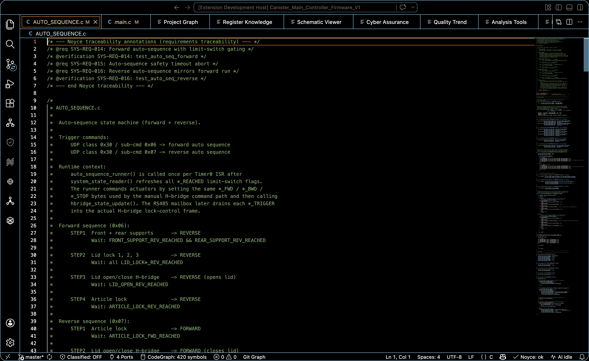

Code viewing is the workbench's own editor — explorer, tabs, git decorations, language services — with Noyce's evidence layered onto it: `@req` / `@verification` annotations resolved against the requirement register, MISRA findings as real diagnostics in the Problems panel, and code-lens agent actions. `Open` from any Noyce surface (MISRA, CodeQL, coupling, the project graph) lands here at the exact line. `.md`/`.markdown` files open in a Milkdown WYSIWYG editor instead of raw text, and `.pdf` in the schematic viewer. The status bar carries the live CodeGraph symbol count, port state, and AI status.

#### Project Graph — symbol / file / macro topology

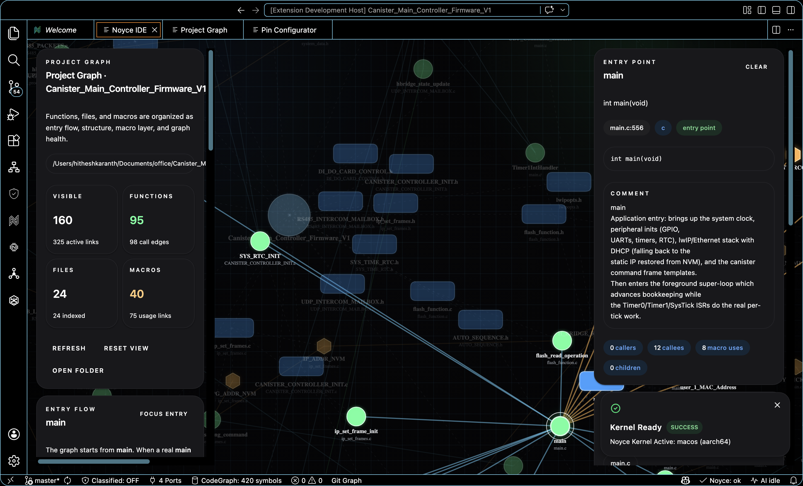

Live dependency view of every function, file, and macro in the workspace — here **160 symbols, 95 functions, 24 files, 40 macros, 325 active links**. The graph roots at the detected entry point (`main`), and selecting a node opens its full detail: source location, doc comment, and its callers / callees / macro uses. **Cluster by** directory, layer, language, Louvain community, or blast radius with coloured concave hulls.

#### System Architecture — C4 model recovered from source

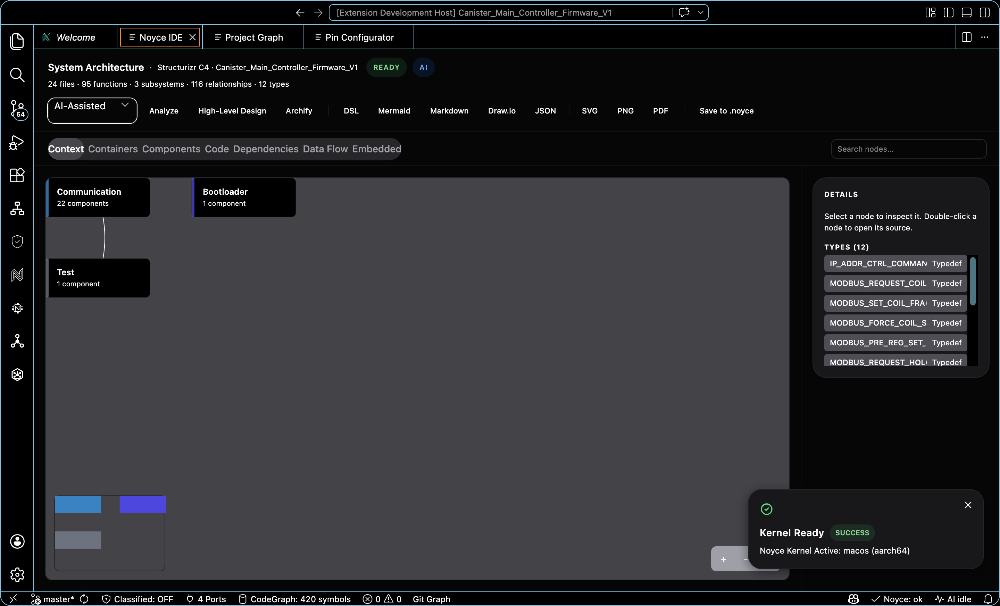

An AI-assisted analyzer reads the codebase and reconstructs a **Structurizr-style C4 model** — here **24 files · 95 functions · 3 subsystems · 116 relationships · 12 types**, with Context / Containers / Components / Code / Dependencies / Data-Flow / Embedded levels. Every node is clickable (double-click opens its source). One-click export to **High-Level Design, Archify diagrams, DSL, Mermaid, Markdown, Draw.io, JSON, SVG, PNG, and PDF**. *(Diagram generation runs against the configured model provider; a cloud or non-reasoning local model is recommended for the AI-drawn Archify/HLD outputs.)*

#### Semantic Search — natural-language RAG over the workspace

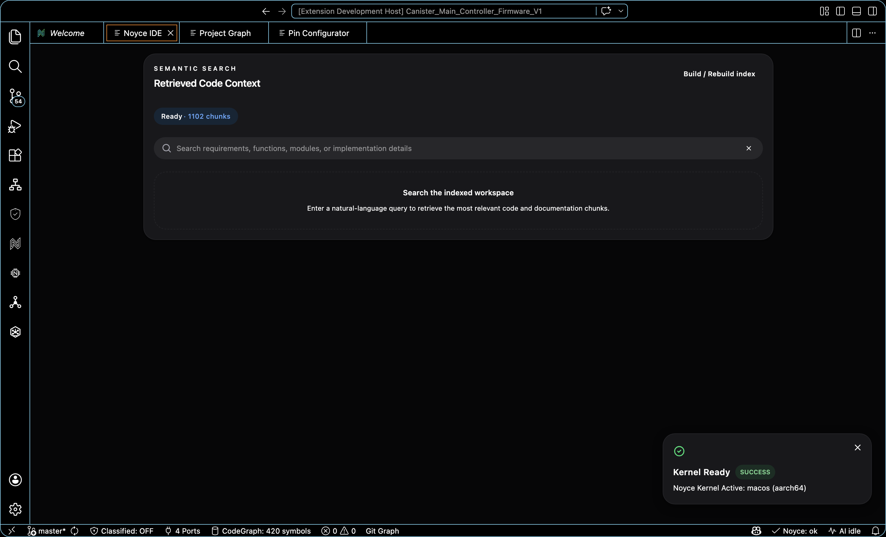

A local nomic-embedding RAG index over the code + requirements powers natural-language search across the workspace — ask a question in plain English and jump to the most relevant functions, files, and requirement chunks. The same index grounds the agent pipeline.

---

### Requirements, coverage & certification (DO-178C)

#### Requirements & Evidence — ALM bridge with a per-requirement evidence ledger

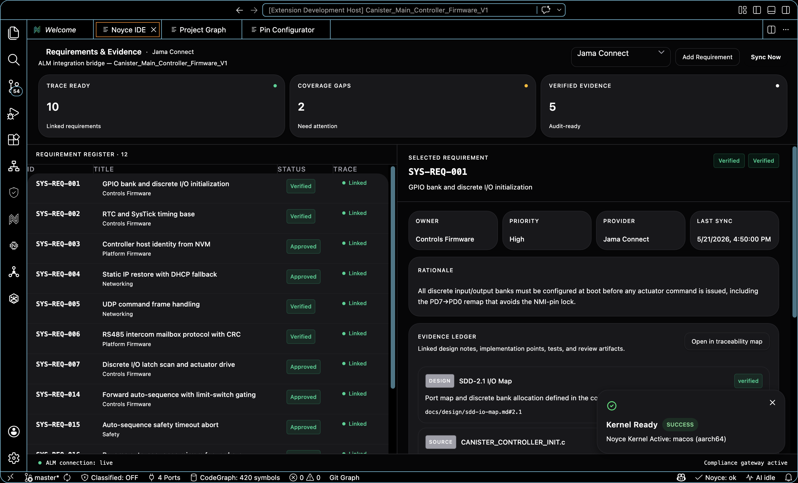

A requirement register synced through an ALM bridge (Jama Connect / generic), each `SYS-REQ` carrying owner, priority, rationale, trace status, and an **evidence ledger** of linked design notes, source lines, tests, and review artifacts — with trace-ready / coverage-gap / verified-evidence roll-ups across the top.

#### Compliance Dashboard — DO-178C Table A objectives, live

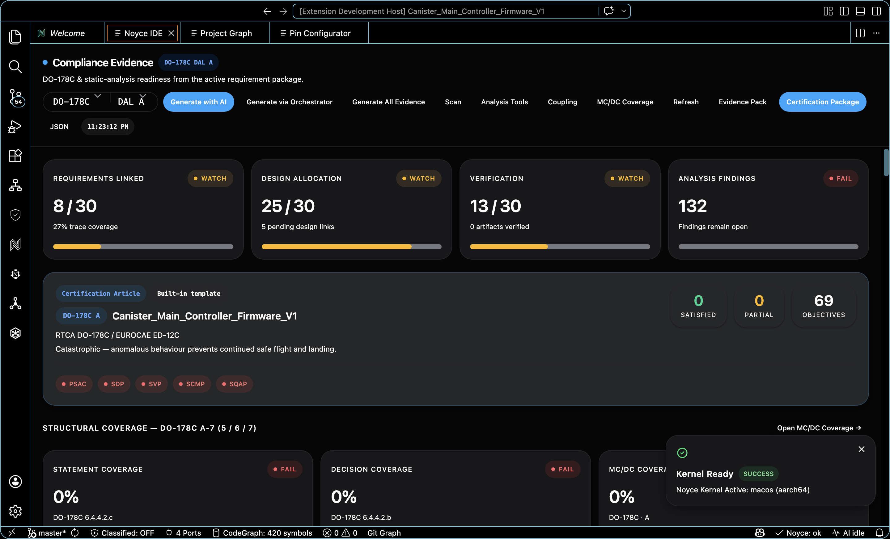

Requirements linked, design allocation, verification evidence, and open static-analysis findings — all derived live from the active project. Each objective routes to its **specialist agent** to generate the artifact, and the toolbar jumps straight to the analysis surfaces (**Coupling**, **MC/DC Coverage**, static analysis, test explorer). Export a DO-178C evidence pack or a SHA-256-anchored **Certification Package**.

#### Traceability Graph — REQ ↔ Design ↔ Test

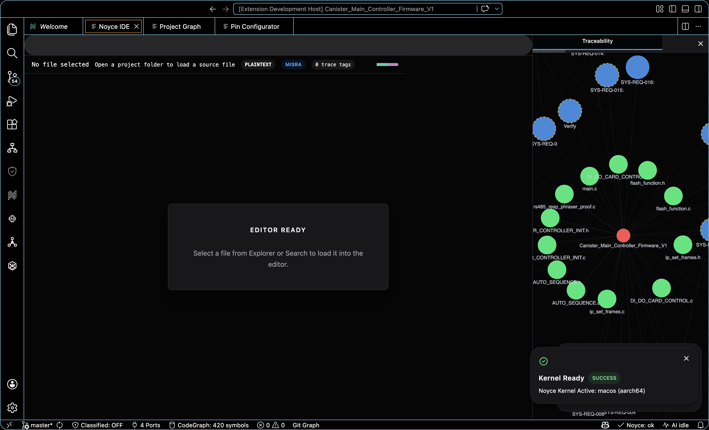

Force-directed graph that ties requirements (`SYS-REQ-001`, …) to source files, design notes, and test cases, built from the same workspace source as the Compliance Dashboard. Verified links render green; orphans and gaps render red.

#### MC/DC Structural Coverage — DO-178C A-7 obj 5/6/7

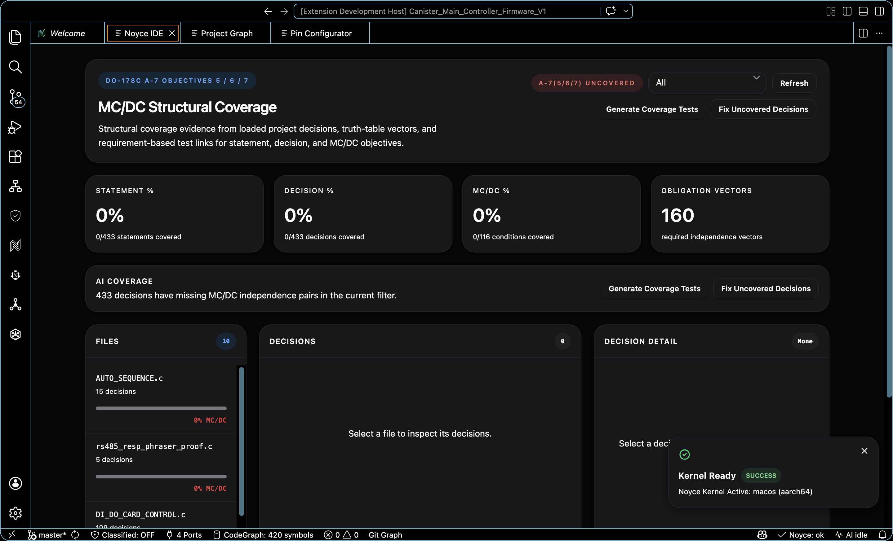

Extracts every decision (`if`/`while`/`for`/ternary) from the loaded firmware, splits each into atomic conditions, and computes the Statement / Decision / MC/DC obligations — here **433 decisions across the project, 116 MC/DC conditions, 160 required independence vectors**, reported honestly as 0% until requirement-based tests are linked. A three-pane files → decisions → truth-table view shows each condition's independence pair, and an **AI Coverage** panel can *Generate Coverage Tests* or *Fix Uncovered Decisions* via the agent pipeline.

#### Data & Control Coupling — DO-178C A-7 obj 8

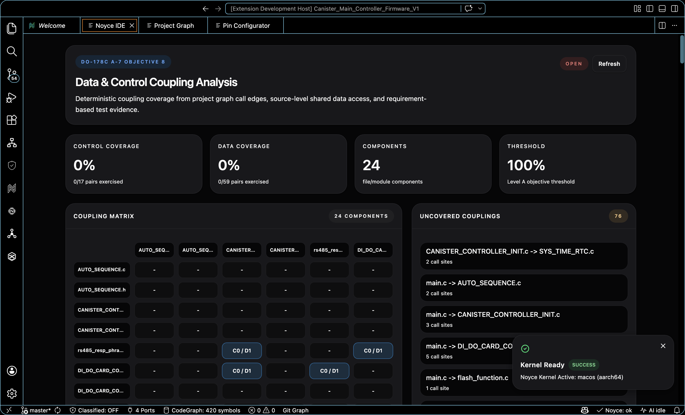

Deterministic coupling coverage computed from the project-graph call edges and source-level shared-data access — here **24 components, 17 control-coupling pairs, 59 data-coupling pairs**, with a coupling matrix and a ranked list of the **76 uncovered couplings** (each with its concrete call sites, e.g. `CANISTER_CONTROLLER_INIT.c → SYS_TIME_RTC.c`). Coverage is honest until requirement-based test evidence links the pairs.

#### CBMC Formal Verification — bounded model checking

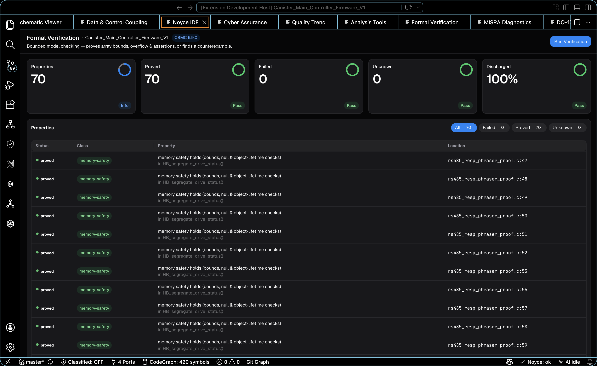

Runs real **CBMC** bounded model checking over the project's harness to discharge array-bounds, overflow, and assertion properties. Captured after an actual run: **CBMC 6.9.0 · 70 properties · 70 proved · 0 failed · 0 unknown · 100% discharged**, each row citing the proof line it came from (`rs485_resp_phraser_proof.c:47` in `HB_segregate_drive_status()`). Anything that fails carries a step-by-step counterexample trace and an AI failure explanation.

#### CodeQL Code Scanning — SARIF security alerts

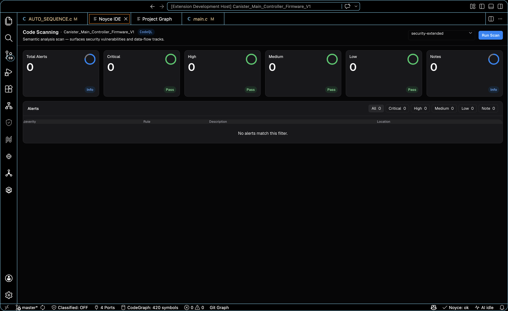

Drives the real **CodeQL** CLI to surface security vulnerabilities as SARIF alerts, walk each finding's data-flow path, and apply a structured, AI-explained remediation patch. Captured after an actual `security-extended` run over the firmware, extracted with `--build-mode=none` so a project with no Makefile still scans: **0 alerts** — this codebase raises nothing at that suite, and the view says so rather than dressing the screen with samples. The query packs come from the vendored CodeQL bundle (`npm run codeql:bootstrap`), so scanning needs no package-registry access.

#### MISRA Diagnostics — rule-decoded findings with agent auto-fix


Consolidated findings from the multi-tool static-analysis run, decoded to the rule (e.g. MISRA C:2025 Rule 15.5 — single point of exit) with severity filters, control-flow context, and a one-click **Auto-fix** that routes structural rules to a function-level refactor agent and applies the result on the host.

#### Test Explorer, DO-178C Documents & Cyber Assurance

<table>
<tr>
<td width="50%"><b>Test Explorer</b> — requirement-linked unit / HIL test tree with pass/fail roll-up<br>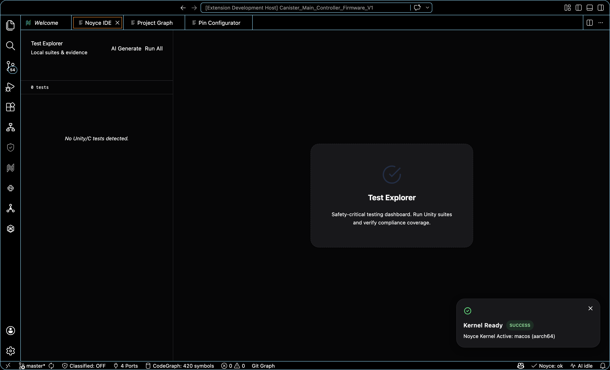</td>
<td width="50%"><b>DO-178C Documents</b> — generated plans &amp; records as formal, print-ready <code>.docx</code><br>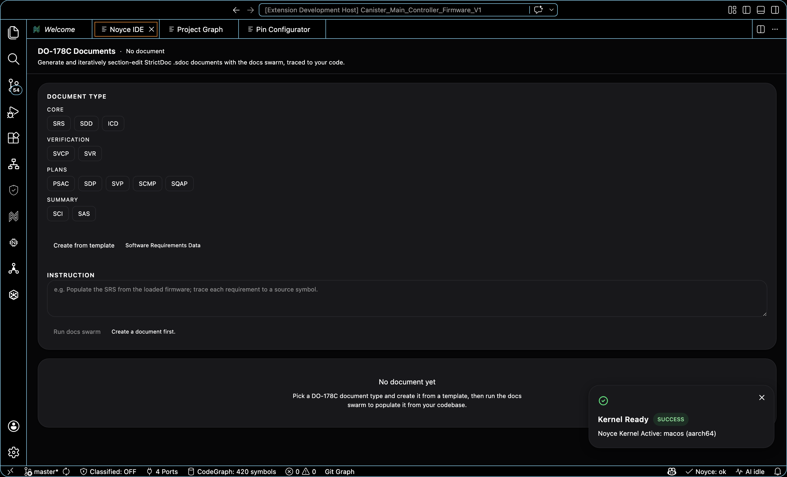</td>
</tr>
<tr>
<td width="50%"><b>Cyber Assurance</b> — real-source SBOM with OSV-backed CVE + CWE posture<br>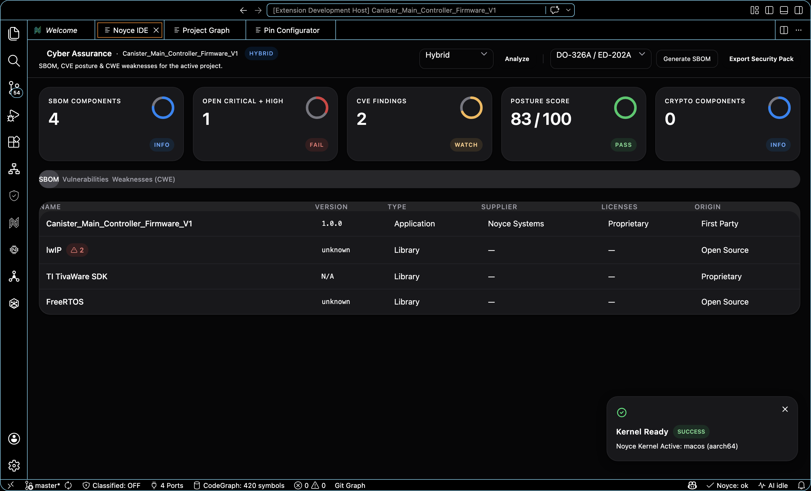</td>
<td width="50%"><b>Immutable Audit Trail</b> — hash-chained review &amp; approval ledger<br>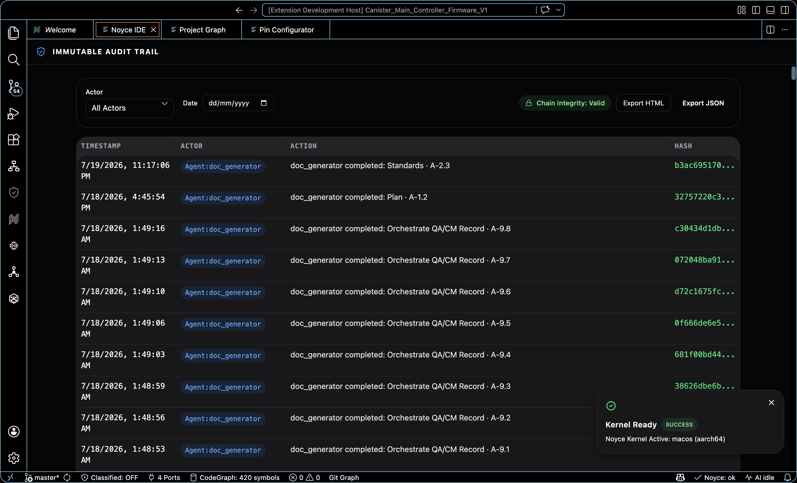</td>
</tr>
</table>

The **Audit Trail** signs every agent completion, review, and approval into a tamper-evident **hash chain** (actor, action, timestamp, per-entry SHA) — filter by actor/date, verify **Chain Integrity** at a glance, and export to HTML or JSON.

---

### Hardware & schematic intelligence

#### Schematic Viewer — the board schematic, rendered

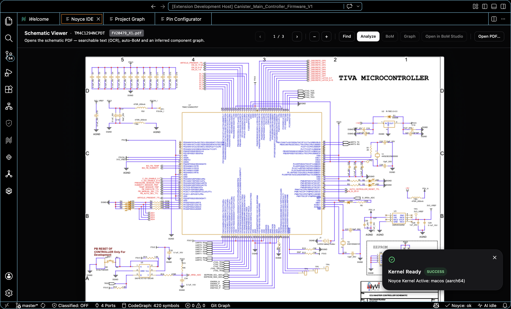

Opens the board's schematic PDF (here the real Tiva TM4C1294 canister-controller sheet, page 1/3) and renders it like a native viewer — pan, zoom, and full-text **Find**. **Analyze** runs positioned-text extraction / OCR to make the drawing searchable to the character and to build the auto-BoM and component graph below.

#### Auto-BoM — extracted *after* analysis

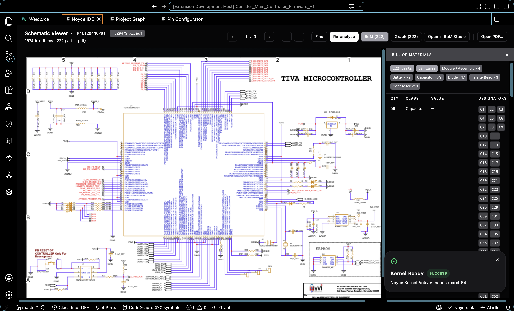

After **Analyze** (here **1,674 text items → 222 parts**), every reference designator is parsed into a class-aware **Bill of Materials** — Capacitor ×79, Diode ×17, Ferrite Bead ×3, Connector ×10, Battery ×2, Module/Assembly ×4 … — grouped by class with quantities and designators, ready to open in the BoM Studio or export.

#### Inferred Component Graph — topology from the layout

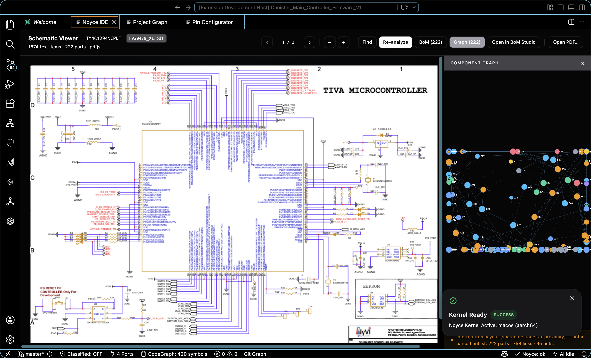

An inferred component relationship graph reconstructs the board topology from shared net labels + proximity — here **222 parts · 758 links · 95 nets** — surfaced next to the schematic. (Inferred from layout, not a parsed netlist.)

#### Register Knowledge — the part's reference manual, indexed and page-cited

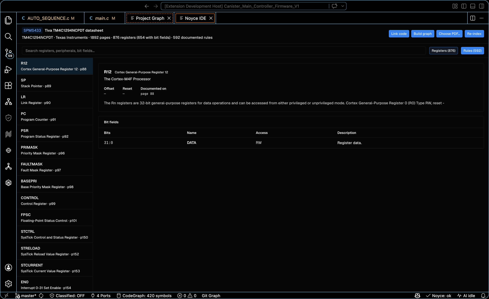

The MCU is detected from the project's own files, its reference manual is fetched from the vendor, and every register section in it is extracted — here the real TI **SPMS433** datasheet for the **TM4C1294NCPDT**: **1,892 pages → 876 registers, 654 of them with decoded bit fields, and 592 documented rules**. Each entry carries the page it came from (`STCTRL · p150`), so a claim about a register can be checked against the manual rather than taken on trust, and the bit-field table is read out of the document, not written by hand. **Link code** ties the registers to the places the firmware touches them; a manual the vendor does not publish can be supplied with **Choose PDF…**.

#### Register Inspector, Peripheral Map, Fault Analyzer, Signal Viewer & Serial Monitor

<table>
<tr>
<td width="50%"><b>Register Inspector</b> — CMSIS-SVD peripherals + live bitfield decode<br>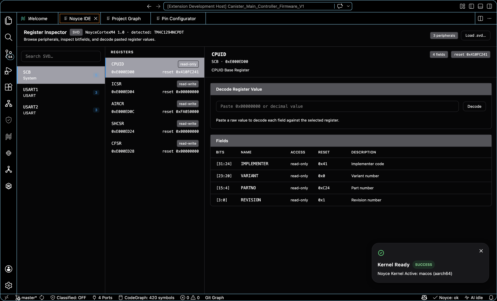</td>
<td width="50%"><b>Peripheral Registers</b> — peripheral / pin map traced from the detected config<br>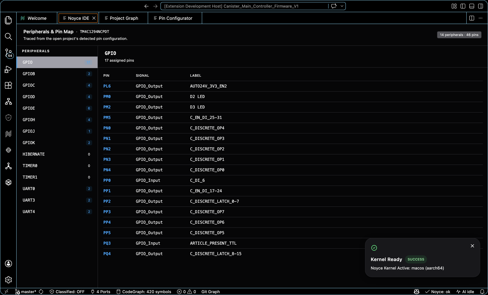</td>
</tr>
<tr>
<td width="50%"><b>Fault Analyzer</b> — Cortex-M HardFault decoded from a register/CFSR dump<br>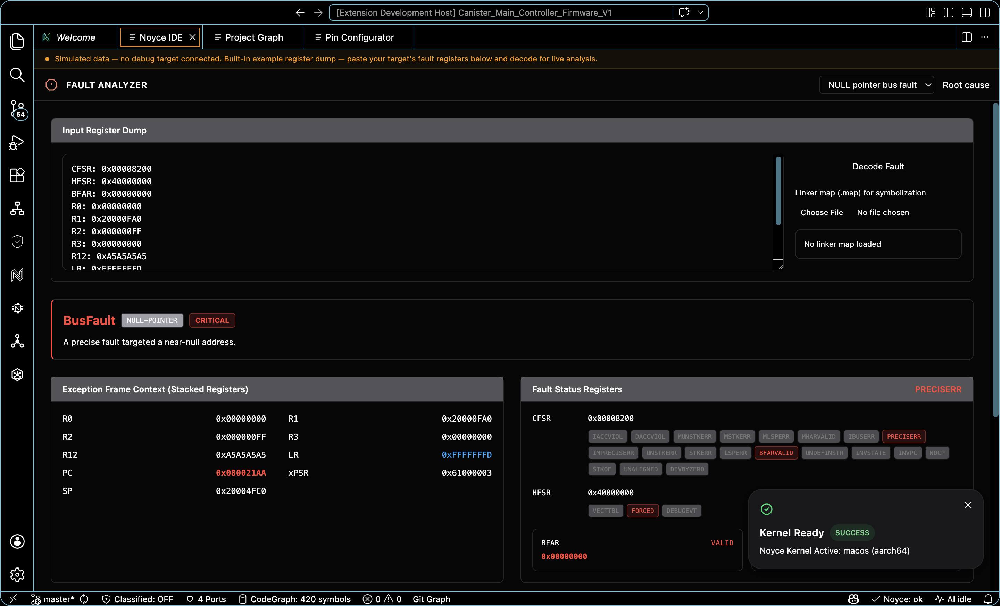</td>
<td width="50%"><b>Signal Viewer</b> — logic-analyzer waveforms (SPI / PWM / PID)<br>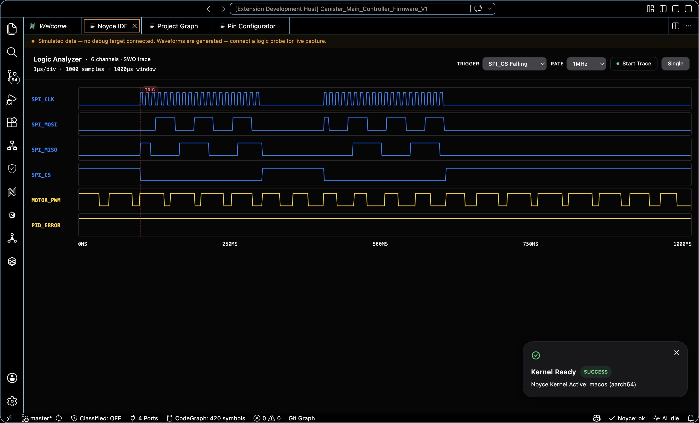</td>
</tr>
<tr>
<td width="50%"><b>Serial Monitor</b> — real serial I/O through the Rust sidecar<br>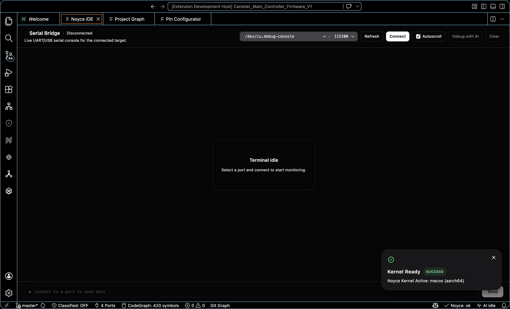</td>
<td width="50%"><b>Build Pipeline</b> — embedded CI stages (analysis → build → unit → HIL → docs) with live logs<br>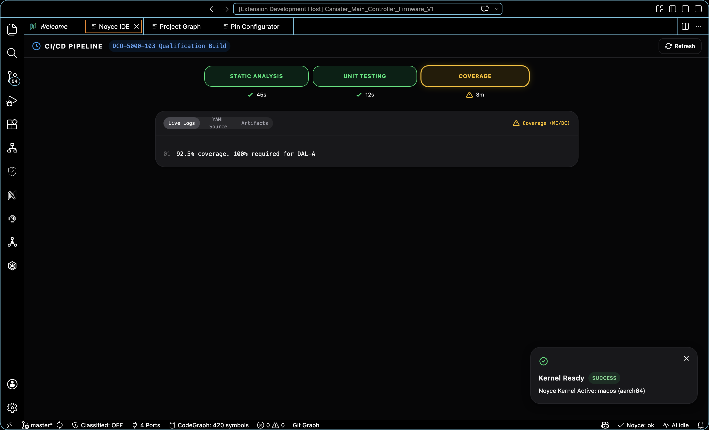</td>
</tr>
</table>

The **Fault Analyzer** decodes a pasted CFSR / HFSR / BFAR + stacked frame into the precise exception (BusFault / MemManage / UsageFault) with the decoded bit flags and an AI root-cause; load the `.map` for symbolised PC/LR. The **Serial Monitor** performs real serial I/O via a pty-tested Rust sidecar.

---

## Features

| Category | Surfaces |
| --- | --- |
| **Compliance & Certification** | **Compliance Run** (frozen configuration · reproducible hashed record · objective-level run diff) · **Annex A assessment** (all 71 Level A objectives, reported as ratios against their real denominators) · Compliance Dashboard (multi-agent per-objective artifact generation) · DO-178C Evidence Pack · **Certification Evidence Package** (SHA-256-anchored, tamper-evident HTML + JSON) · Traceability Graph · Requirements Explorer · MISRA Diagnostics + single-exit auto-fix · MC/DC Coverage + shortfall resolution (dead / deactivated / justified) · Quality Trend · Annotation Navigator · Immutable Audit Ledger (hash-chained) |
| **Verification & Security** | Formal Verification (real CBMC bounded model checking · properties table · counterexample trace) · Code Scanning (real CodeQL · SARIF alerts · data-flow paths · AI remediation) · Cyber Assurance (real-source SBOM + OSV CVEs) |
| **Verification records** | Verification cases and results (method · normal-range / robustness · host / simulator / target) · requirements-based coverage · executed-result attribution with orphan-test detection · Unity runner integration |
| **Process records** | Problem reports & change control (classification · disposition · independent closure) · Review records with **derived** independence (author ≠ reviewer) · Conformity review (the SOI #4 checklist) |
| **Architecture** | Architecture Analyzer (swark-style source → Gemma → Mermaid) · High-Level Design view · C4 / Structurizr export |
| **Static analysis** | 755-tool catalog (vendored analysis-tools-dev) with language-filtered Browse Catalog · runnable subset (cppcheck · clang-tidy · ESLint · Ruff · ShellCheck) · catalog-driven multi-tool scans |
| **Hardware-aware editing** | Pin Configurator · Peripheral Registers · **Register Knowledge** (vendor reference manual indexed to page-cited registers + bit fields, interlinked with the code) · Register Inspector (CMSIS-SVD) · Memory View · RTOS Thread Viewer · **Schematic Viewer** (LiteParse + PaddleOCR text/search · auto-BoM · inferred component graph · pan/zoom) · Debug Probe Panel · Fault Analyzer (Cortex-M CFSR decoded) · Linker Memory Map (GNU ld) |
| **Signal & protocol** | Logic-analyzer Signal Viewer · Serial Monitor · Modbus Monitor · Energy Profiler (LoRa / BLE / sense-burst presets) · Live Data Dashboard (Power / Motor / Comms) |
| **CI / Build** | Build Pipeline (Static Analysis / Build / Unit / HIL / Docs) · Build Size Treemap · Project Templates · Project Graph |
| **AI** | Multi-agent Orchestrator · Agents Chat with persona + per-call model selection · Provider settings (Gemini / Anthropic / OpenAI / Ollama / LM Studio / Codex CLI / Claude CLI) · Inline completions · Code-lens agent actions |
| **Team & lifecycle** | Team Activity · Review Workflow · Audit Log · Project Templates |
| **Importers** | STM32CubeIDE `.ioc` · TI Tiva (TivaWare) · Code Composer Studio · MPLAB X / NetBeans · Generic folder |

---

## Architecture

```text
Noyce IDE (single Electron process tree)
├── Code-OSS desktop shell
│   ├── Noyce product.json overlay + rebrand patch
│   └── 11 first-party VS Code extensions
│       (core-ui · stm32 · fpga · telemetry · compliance · hardware ·
│        lifecycle · project-graph · architecture · agents · chat)
│
├── React 18 + TypeScript bundle  (src/, built by Vite)
│   ├── Workbench surfaces (compliance, build, AI, hardware, …)
│   ├── Monaco editor · D3 graphs · xterm.js · Tailwind
│   └── Density-responsive panels (sidebar ↔ editor-tab)
│
└── Rust sidecar  (services/noyce-core/)
    ├── JSON-RPC over stdio
    ├── Workspace IO, project import (.ioc / CCS / MPLAB / Tiva)
    ├── Static-analysis + MISRA scanners
    ├── CBMC formal verification dispatch
    └── Hardware enumeration (serial, debug probes, JTAG)
```

The release path keeps Noyce-owned configuration **separate from the vendored Code-OSS checkout**: `scripts/lib/codeoss-pin.json` pins upstream commit + Node version; `npm run codeoss:bootstrap:windows` prepares the checkout, renders `apps/noyce-workbench/generated/product.json`, syncs it into Code-OSS, applies the tracked rebrand patch, and copies overlay files (icons, badge, welcome content).

**Project stays pristine** — everything the IDE generates for an open project (certification evidence, traceability / DO-178C docs, the audit ledger, CodeQL scratch, schematic analysis) is written under a single `<project>/.noyce/` working directory that carries its own `.gitignore` (`*`). The workbench never scatters files across the project root or touches any existing file — including the project's own `.gitignore` — so the codebase you opened is unchanged and git-clean. Host-side schematic parsing (LiteParse + PaddleOCR, via the extension host) and CodeQL both run through the host bridge and clean up their scratch, falling back to in-webview engines when no host is attached.

---

## Repository Layout

| Path | Role |
| --- | --- |
| `apps/noyce-workbench/` | Product template, checkout sync scripts, generated product config, overlay assets, rebrand patch |
| `third_party/code-oss/` | Pinned upstream Code-OSS source used for reproducible workbench builds |
| `src/` | Shared React surfaces (compliance, hardware, AI, build, project graph, …) |
| `extensions/` | First-party Noyce VS Code extensions (10 of them) |
| `services/noyce-core/` | Rust sidecar — JSON-RPC over stdio for workspace IO, importers, hardware enumeration |
| `crates/` | STM32 / Tiva importers, project model utilities |
| `tests/` | Playwright smoke + feature-tour specs |
| `scripts/` | Bootstrap + release scripts (Windows installer, signing, schema check) |

---

## Quick Start

### Local React surface (fast UI iteration)

```bash
npm install
npm run dev               # Vite at http://localhost:5173 — React surfaces, mock data
```

### Full Code-OSS workbench (release-grade)

Prerequisites: Node `22.22.1`, Python 3, Visual Studio Build Tools with VC v142 Spectre components (Windows), Git.

```bash
# Windows build
npm ci
npm run codeoss:bootstrap:windows   # prepares third_party/code-oss
npm run workbench:launch            # opens the workbench

# macOS / Linux (already-built shell)
npm ci
npm run workbench:launch
```

`npm run workbench:doctor:windows` diagnoses missing prereqs. See [`docs/windows-code-oss-remediation.md`](docs/windows-code-oss-remediation.md).

### Verification

```bash
npm run build         # tsc + vite production build
npm run smoke:ui      # Playwright smoke (CI gate)
npm run check         # build + cargo check on the Rust sidecar
npm run rpc:schema:check
npm run test:qc       # UI/host invariants — each rule encodes a fault that shipped once
npm run qc:capture    # screenshot all 26 surfaces from the running Code-OSS build
```

`qc:capture` needs the workbench already running with a real project and the debug port open — launch it through the node script, since the npm layers swallow the passthrough flag:

```bash
node apps/noyce-workbench/scripts/launch-checkout-workbench.mjs \
  --sync-product --remote-debugging-port=9222 /path/to/firmware
```

Screenshots land in `<repo>/.noyce/qc-views/` (gitignored). The harness captures; it does not judge — review the images.

The single CI gate is `.github/workflows/ci-runtime-smoke.yml` — runs `npm run verify:ui` on every push and PR to `main`.

---

## Build & Release

| Workflow | Trigger | Output |
| --- | --- | --- |
| `ci-runtime-smoke.yml` | push / PR to `main` | tsc + vite build, Playwright smoke |
| `release-windows.yml` | tag `v*` or `workflow_dispatch` | Signed Windows x64 installer attached to release |

```bash
npm run release:windows           # local installer build
npm run release:signing:check     # verify code-signing env
```

---

## Tech Stack

**Frontend** — React 18 · TypeScript 5.6 · Vite 5 · Tailwind 3 · Monaco · D3 · xterm.js
**Desktop shell** — Code-OSS · Electron · 10 first-party VS Code extensions
**Native sidecar** — Rust · `tokio` · `serialport` · `probe-rs` · `walkdir`
**AI providers** — Google Gemini · Anthropic · OpenAI · Ollama · LM Studio · Codex CLI · Claude CLI
**Quality** — TypeScript strict · Playwright smoke + feature tour · `cargo check`

---

## Distribution

End-user downloads live at [`Hitheshkaranth/noyce-ide-dist`](https://github.com/Hitheshkaranth/noyce-ide-dist). This repository hosts the source; the dist repository ships installers.

## License

Proprietary — © 2026 Noyce IDE. All rights reserved.

---

<div align="center">

<sub>Built for engineers who ship firmware that has to be right.</sub>

</div>
