<div align="center">


### The AI-native IDE for safety-critical embedded engineering

Bring requirements, code, certification evidence, hardware tooling, and a multi-agent AI pipeline into one Code-OSS-based workbench — purpose-built for **DO-178C**, **ISO 26262**, and **MISRA-grade** firmware teams.

[](https://www.typescriptlang.org/)
[](https://react.dev/)
[](https://vitejs.dev/)
[](https://tailwindcss.com/)
[](https://github.com/microsoft/vscode)
[](https://www.electronjs.org/)
[](https://www.rust-lang.org/)
[](https://microsoft.github.io/monaco-editor/)
[](https://d3js.org/)
[](https://playwright.dev/)
[](https://github.com/Hitheshkaranth/noyce-ide-dist/releases)
[](#license)

[**Download**](#download) · [**Features**](#features) · [**Architecture**](#architecture) · [**Quick Start**](#quick-start) · [**Source**](https://github.com/Hitheshkaranth/noyce_ide)

</div>

---

## Why Noyce IDE

Modern safety-critical firmware work is fragmented across requirements managers, static analyzers, traceability matrices, CI dashboards, AI assistants, and a stack of vendor IDEs. **Noyce IDE collapses all of that into one Code-OSS workbench** with first-class support for:

- **Hardware-aware editing** — pin maps, peripheral registers, RTOS thread state, schematic views, signal/protocol decoders.
- **Certification evidence built-in** — DO-178C Table A objectives, MISRA rule decoding, MC/DC coverage, immutable audit trail. Each objective routes to its **specialist agent** (System Designer → SRS/SDD, Test Engineer → test cases, Compliance Reviewer → verification records) to generate the artifact.
- **A 755-tool static-analysis catalog** — browse the vendored [analysis-tools-dev](https://github.com/analysis-tools-dev/static-analysis) catalog filtered to your stack, run a curated executable subset (cppcheck, clang-tidy, ESLint, Ruff, ShellCheck), and apply MISRA single-exit auto-fixes.
- **A multi-agent AI pipeline** — system designer, coder, reviewer, tester, doc generator, traceability monitor — each with its own configurable model provider; generated objectives sync straight into the AI Orchestrator kanban.
- **Real CI surfaces** — build, static analysis, unit, HIL, and traceability stages in one live pipeline view.

It looks like the IDE you already use, on a clean shadcn-neutral design system. It works the way safety teams already audit.

---

## Screenshots

### Multi-agent orchestrator — plan, dispatch, and run the agent pipeline

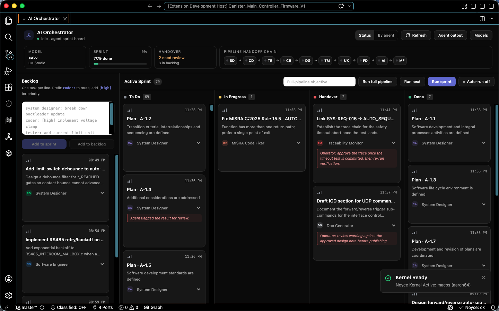

The Orchestrator is a kanban board where each card carries a persona (System Designer, Software Engineer, Test Engineer, Doc Specialist, Reviewer Agent) and moves Backlog → To Do → In Progress → Handover → Done. Agent runs are queued into a sprint and dispatched in parallel. **Compliance objectives generated on the dashboard sync straight into the board** and sort to the top, each routed to its owning agent — and the whole board persists to the project.

### DO-178C compliance evidence — at-a-glance and audit-ready

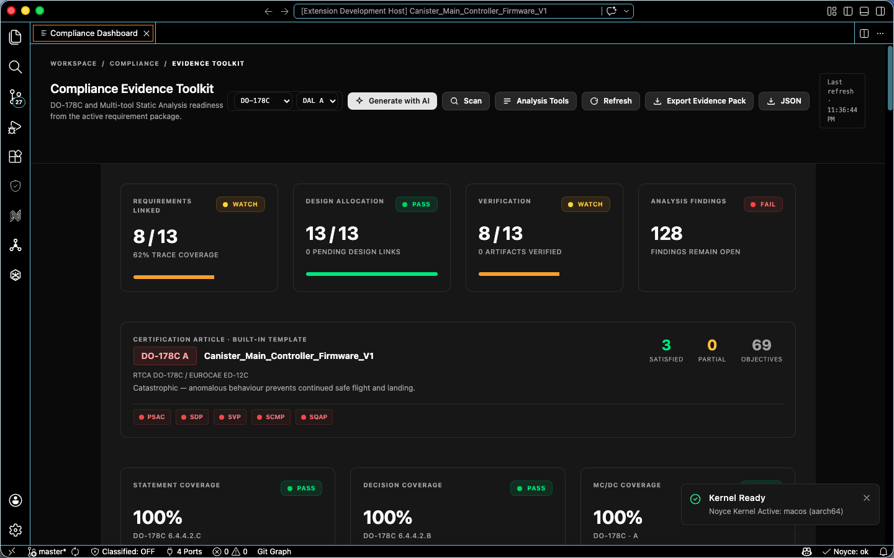

Requirements linked, design evidence, verification evidence, and open static-analysis findings — all derived live from the active project. Generate the full objective package with AI, then produce each objective's artifact via its **specialist agent**, and export a one-click DO-178C evidence pack.

### Traceability graph — REQ ↔ Design ↔ Test, visualised

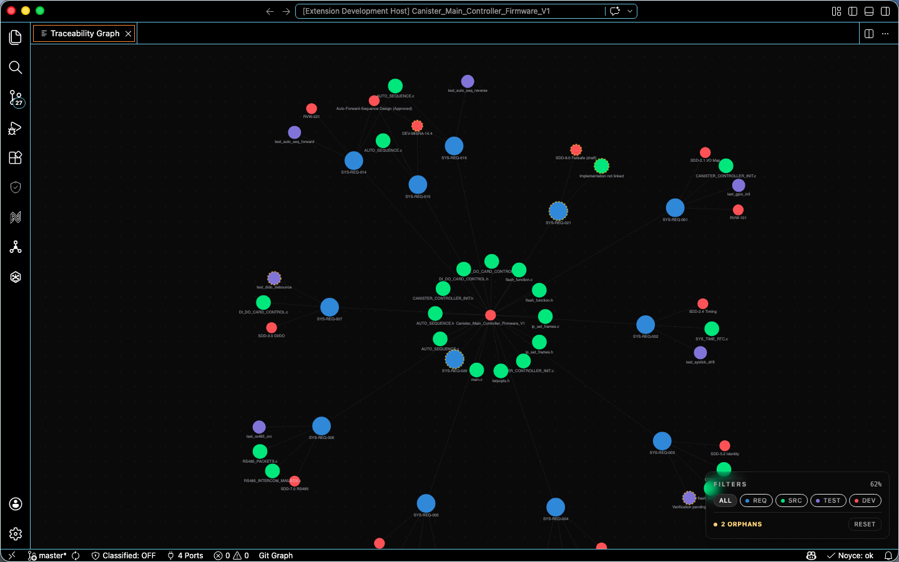

A D3 force-directed graph that ties requirements (`SYS-REQ-001`, …) to source files, design notes, and test cases. Verified links render green; orphans and gaps render red.

### CI/CD pipeline — embedded build stages with live logs

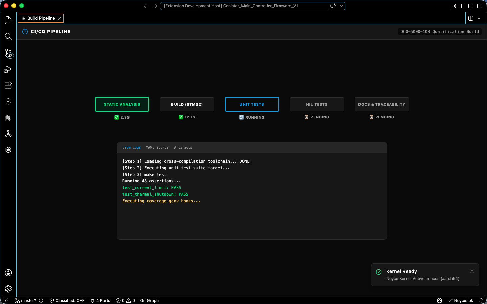

Static Analysis → Build → Unit Tests → HIL Tests → Docs & Traceability. Live log streams in-pane, with per-stage status. Built for STM32, Tiva, PIC32, and generic Cortex-M targets.

### Project graph — symbol, file, and macro topology

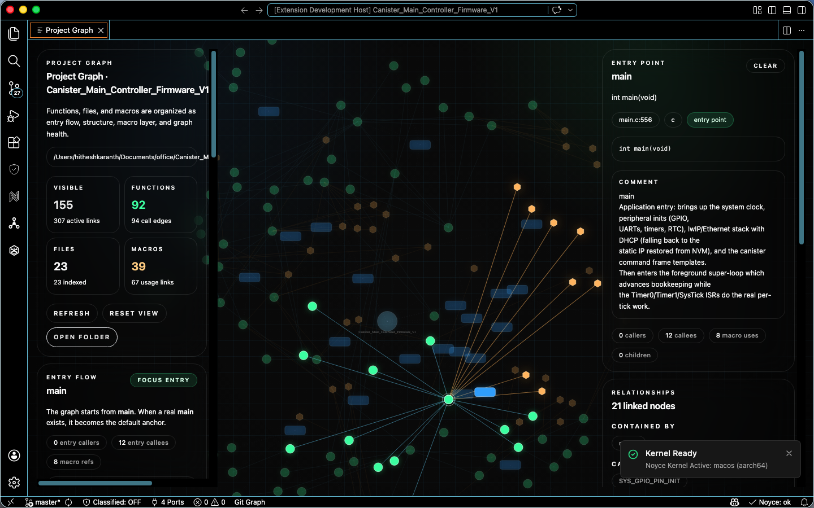

A live dependency view of every function, file, and macro in the workspace. Click any symbol to see its callers, callees, and macro neighbourhood — independent of toolchain.

### Pin Configurator — full-package pinmux, peripheral-aware

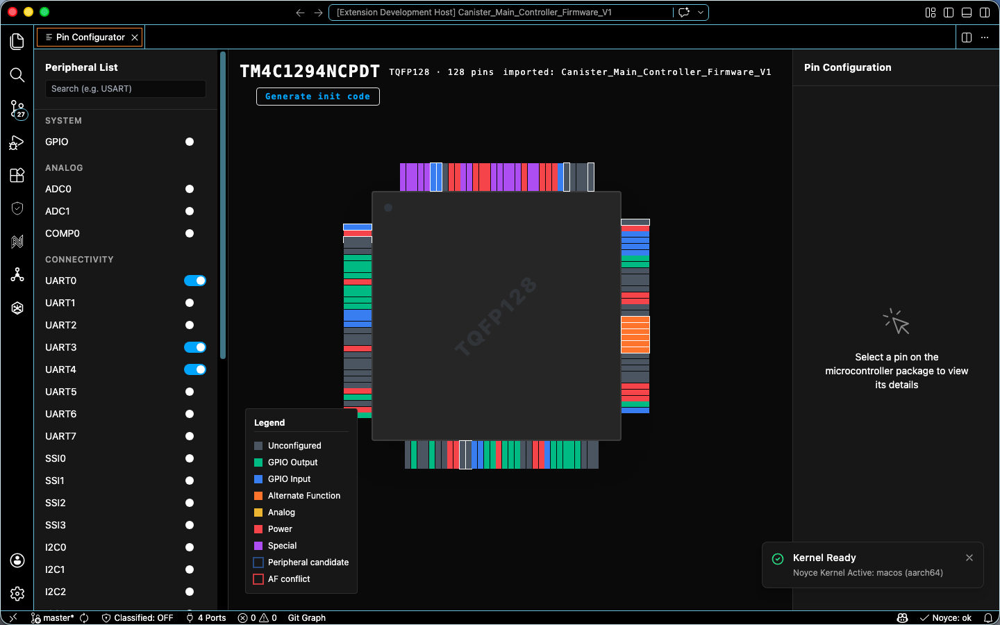

Visual pin map for the active MCU (TM4C129, STM32F4/G/H, RP2040, …). Pick from the peripheral list on the left to highlight candidate pins, click any pin on the chip package to assign its alternate function, and review the legend's GPIO / Analog / AF / conflict states inline. Pin assignments load directly from the imported project (`.ioc`, TivaWare, generic).

### AI model preferences — multi-provider, per-persona

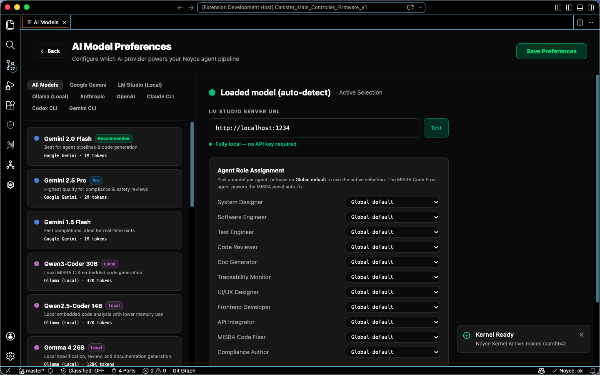

One screen to wire **Gemini, Anthropic, OpenAI, Ollama (local), LM Studio (local)** to the six agent roles. Switch a single role to a local model for confidential workloads; keep the rest on a cloud provider.

### Safety review hub — deviation approval with AI pre-check

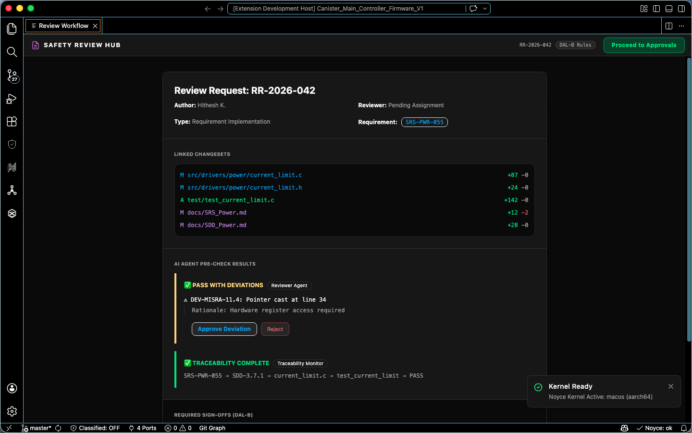

Every code review packet carries linked changesets, AI agent pre-check results (PASS / pass-with-deviation), and a traceability monitor's verdict. Reviewers approve, reject, or escalate — and the decision is signed into the immutable audit log.

### Project templates — enterprise-grade scaffolds

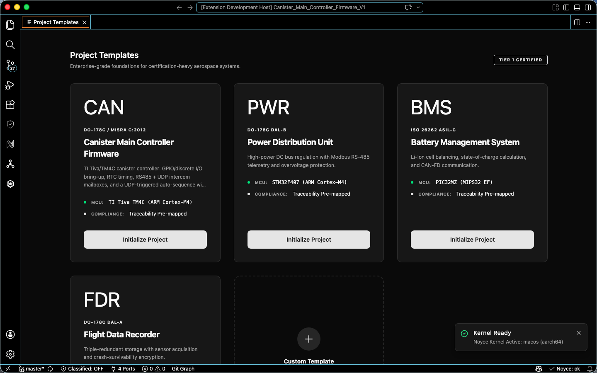

Cert-ready starter projects for canister controllers, power distribution units, battery management systems, and flight data recorders — each pre-mapped to a traceability matrix and a compliance profile.

### MISRA Diagnostics — rule-decoded findings with agent auto-fix

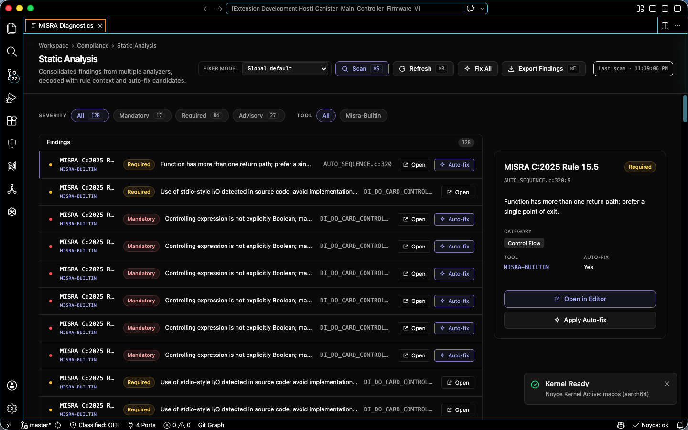

Findings from the multi-tool static-analysis run, decoded to the rule (e.g. MISRA C:2025 Rule 15.5 — single point of exit) with severity, control-flow context, and a one-click **Auto-fix** that routes structural rules to a function-level refactor agent and applies the result on the host.

### Quality Trend — live maintainability & complexity

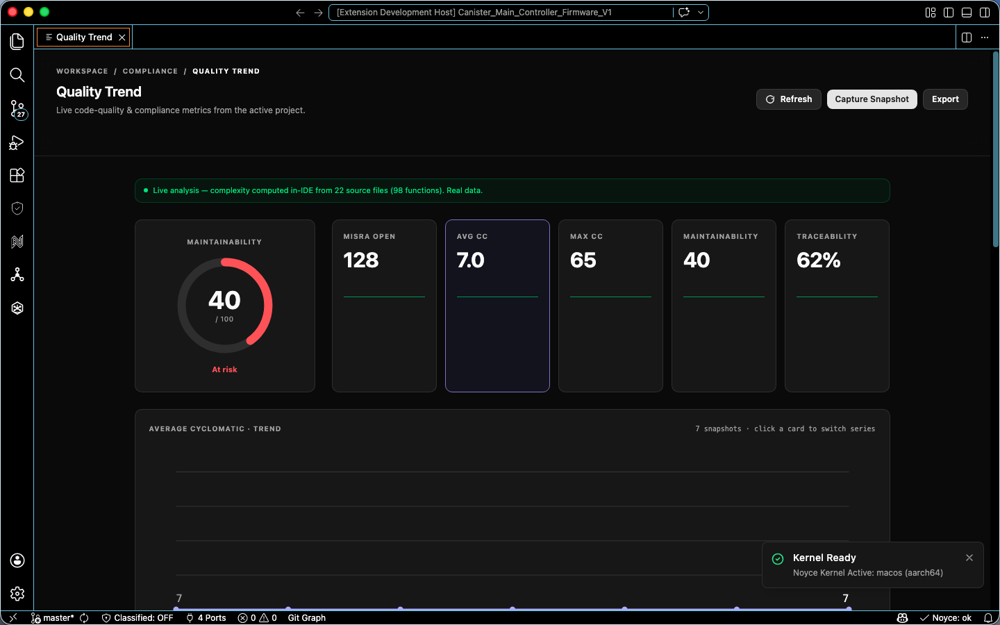

Maintainability gauge plus MISRA-open, cyclomatic complexity, and traceability metrics computed in-IDE from the active project's sources — with per-snapshot trend charts to watch quality drift over time.

---

## Features

| Category | Surfaces |
| --- | --- |
| **Compliance & Certification** | Compliance Dashboard (multi-agent per-objective artifact generation) · DO-178C Evidence Pack · Traceability Graph · Requirements Explorer · MISRA Diagnostics + single-exit auto-fix · MC/DC Coverage · Quality Trend · Annotation Navigator · Audit Log |
| **Static analysis** | 755-tool catalog (vendored analysis-tools-dev) with language-filtered Browse Catalog · runnable subset (cppcheck · clang-tidy · ESLint · Ruff · ShellCheck) · catalog-driven multi-tool scans |
| **Hardware-aware editing** | Pin Configurator · Peripheral Registers · Memory View · RTOS Thread Viewer · Schematic Viewer · Debug Probe Panel · Fault Analyzer (Cortex-M CFSR decoded) · Linker Memory Map |
| **Signal & protocol** | Logic-analyzer Signal Viewer · Serial Monitor · Modbus Monitor · Energy Profiler (LoRa / BLE / sense-burst presets) · Live Data Dashboard (Power / Motor / Comms) |
| **CI / Build** | Build Pipeline (Static Analysis / Build / Unit / HIL / Docs) · Build Size Treemap · Project Templates · Project Graph |
| **AI** | Multi-agent Orchestrator · Agents Chat with persona + per-call model selection · Provider settings (Gemini / Anthropic / OpenAI / Ollama / LM Studio / Codex CLI / Claude CLI) · Inline completions · Code-lens agent actions |
| **Team & lifecycle** | Team Activity · Review Workflow · Audit Log · Project Templates |
| **Importers** | STM32CubeIDE `.ioc` · TI Tiva (TivaWare) · Code Composer Studio · MPLAB X / NetBeans · Generic folder |

---

## Architecture

```text
Noyce IDE (single Electron process tree)
├── Code-OSS desktop shell
│   ├── Noyce product.json overlay + rebrand patch
│   └── 10 Noyce extensions (core-ui, stm32, fpga, telemetry,
│       compliance, hardware, lifecycle, project-graph, agents,
│       core)
│
├── React 18 + TypeScript UI bundle (Vite)
│   ├── Workbench surfaces (compliance, build, AI, hardware, …)
│   ├── Monaco editor · D3 graphs · xterm.js · Tailwind
│   └── Density-responsive panels (sidebar ↔ editor-tab)
│
└── Rust sidecar  (services/noyce-core/)
    ├── JSON-RPC over stdio
    ├── Workspace IO, project import (.ioc / CCS / MPLAB / Tiva)
    ├── Static-analysis + MISRA scanners
    └── Hardware enumeration (serial, debug probes, JTAG)
```

The release path keeps Noyce-owned config separate from the vendored Code-OSS checkout: `scripts/lib/codeoss-pin.json` pins upstream commit + Node version; `npm run codeoss:bootstrap:windows` prepares the checkout, renders `apps/noyce-workbench/generated/product.json`, syncs it into Code-OSS, applies the tracked patch, and copies overlay files (icons, badge, welcome).

---

## Download

| Platform | Architecture | File |
| --- | --- | --- |
| macOS | Apple Silicon (arm64) | [`Noyce_macOS_aarch64.dmg`](https://github.com/Hitheshkaranth/noyce-ide-dist/releases/latest/download/Noyce_macOS_aarch64.dmg) |
| Windows | x64 | [`NoyceIDE-win32-x64.exe`](https://github.com/Hitheshkaranth/noyce-ide-dist/releases/latest) (system installer) |
| Linux | x64 | coming soon |

> After install, open **AI Models** (Noyce AI → AI Models) and add a provider key. Gemini, Anthropic, and OpenAI accept cloud keys; Ollama and LM Studio auto-discover locally.

---

## Quick Start

```bash
# 1. Install the build (above)
# 2. Launch Noyce IDE
# 3. Open the project to certify
File ▸ Open Folder ▸  <your-firmware-repo>

# 4. Configure a model
Cmd/Ctrl + Alt + N ▸ "AI Models"  →  paste API key  →  assign to agent roles

# 5. Run the pipeline
Cmd/Ctrl + Alt + N + G        # Run Agent Pipeline
Cmd/Ctrl + Alt + N + B        # Open Build Pipeline
Cmd/Ctrl + Alt + N + C        # Compliance Dashboard
Cmd/Ctrl + Alt + N + M        # MISRA Diagnostics
```

The **Scan Workspace** action in the Compliance Dashboard discovers `@req`, `@verification`, and `@design` markers in source comments and populates the traceability graph in one pass.

---

## Tech Stack

**Frontend** — React 18 · TypeScript 5.6 · Vite 5 · Tailwind 3 · Monaco · D3 · xterm.js
**Desktop shell** — Code-OSS · Electron · 10 first-party VS Code extensions
**Native sidecar** — Rust · `tokio` · `serialport` · `probe-rs` · `walkdir`
**AI providers** — Google Gemini · Anthropic · OpenAI · Ollama · LM Studio · Codex CLI · Claude CLI
**Quality** — TypeScript strict · Playwright smoke + feature tour · `cargo check`

---

## Status

- **macOS Apple Silicon** — release-grade
- **Windows x64** — installer build via GitHub Actions on `v*` tags
- **Linux** — roadmap
- **AI providers** — Gemini ready in build; Anthropic / OpenAI / Ollama / LM Studio wired through the agents extension; Codex CLI and Claude CLI route through local CLIs

---

## Source

The full source lives at [`Hitheshkaranth/noyce_ide`](https://github.com/Hitheshkaranth/noyce_ide). This repository ships the **download landing page** and **release artifacts** only.

## License

Proprietary — © 2026 Noyce IDE. All rights reserved.

---

<div align="center">

<sub>Built for engineers who ship firmware that has to be right.</sub>

</div>
